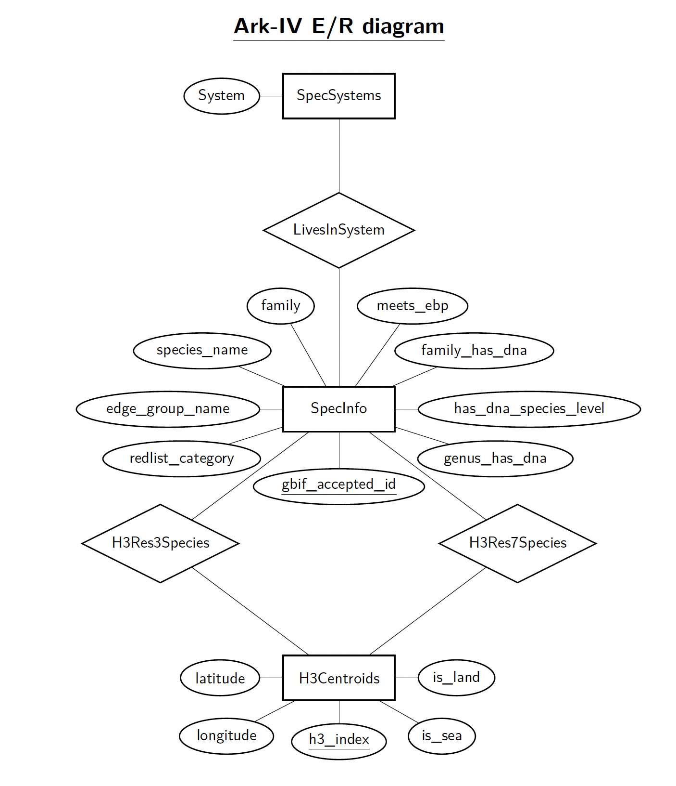
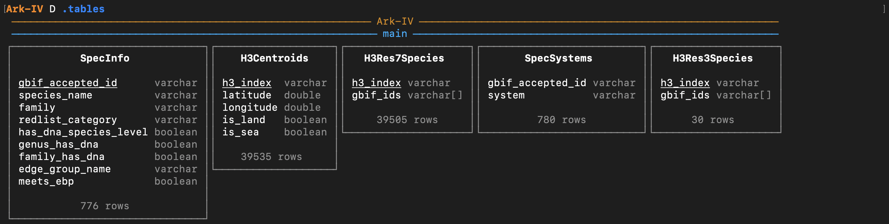

# Ark-IV

## About the project
Our data-app project is about the conservation of species by the use of DNA sequencing. Our solution helps synthesize existing data sources like the IUCN and GOAT databases in a beautiful and interactive map experience.

## Usage
For our project, we used the UV package manager to keep track of integrations and run the app. To install UV, simply go to their page https://docs.astral.sh/uv/getting-started/installation/ and follow their guidelines or if using Homebrew use the command below.
```bash
brew install uv
```

Once UV has been installed, to run the app, you simply run the following command:

```bash
uv sync && uv run app/app.py
```

which will install all the required packages into a local virtual environment *ark-iv*. Afterward, you can use the webapp by going to your localhost at port 5000, or just run the following command in a split terminal:

```bash
open http://127.0.0.1:5000
```

There is a tutorial on how to use the webapp at:
```bash
open http://127.0.0.1:5000/tutorial
```


## Databases
We store our databases in .*duckdb* files in our *data* folder.

During runtime, we use a pre-computed cache to load in the relevant data, 

***data/precomputed_cache.duckdb***

saving memory and compute.

The precomputed cache is built solely from *data/Ark-IV.duckdb* which can be inspected for a more detailed understanding of the database. The script that builds this can be found at: *app/build_cache.py*. To save you from downloading too much data and also having licensing problems, the data used to build *Ark-IV.duckdb* has been gitignored, but the script can be viewed at *DIKUs-Ark/app/build_db.py*

## E/R Moden Diagram:
We can model the Ark-IV database by the following entity-relationship diagram:



The specific schemas of the ***data/Ark-IV.duckdb*** database is as follows:

 

However, in practice, the tables H3Res3Species relations aren't on any normal form as they have lists as elements in a reasonable manner due to duckdb.
