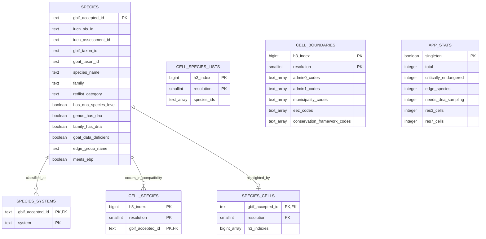

# Serving schema

The global application uses PostgreSQL for relational API reads and keeps the
large resolution-7 aggregate and species-list partitions outside the database.
This diagram replaces the prototype-era database screenshots.

`cell_species` is retained only for compatibility and small builds. Global
serving uses one `cell_species_lists` row per coarse H3 cell and one
`species_cells` inverse row per species. Fine resolution-7 map metrics and exact
selected-cell species lists are read from independently versioned, spatially
partitioned Parquet files.

`cell_boundaries` records every boundary intersected by a cell. Multiple values
are arrays, so a border cell can belong to more than one jurisdiction. Country
memberships already include their matching EEZ scope; `eez_codes` remains for
location context and internal queries, not as a separate user-facing filter.

The authoritative DDL is `backend/schema.sql`. Build-time DuckDB relations are
transient transformation details and are intentionally absent from this serving
diagram.
