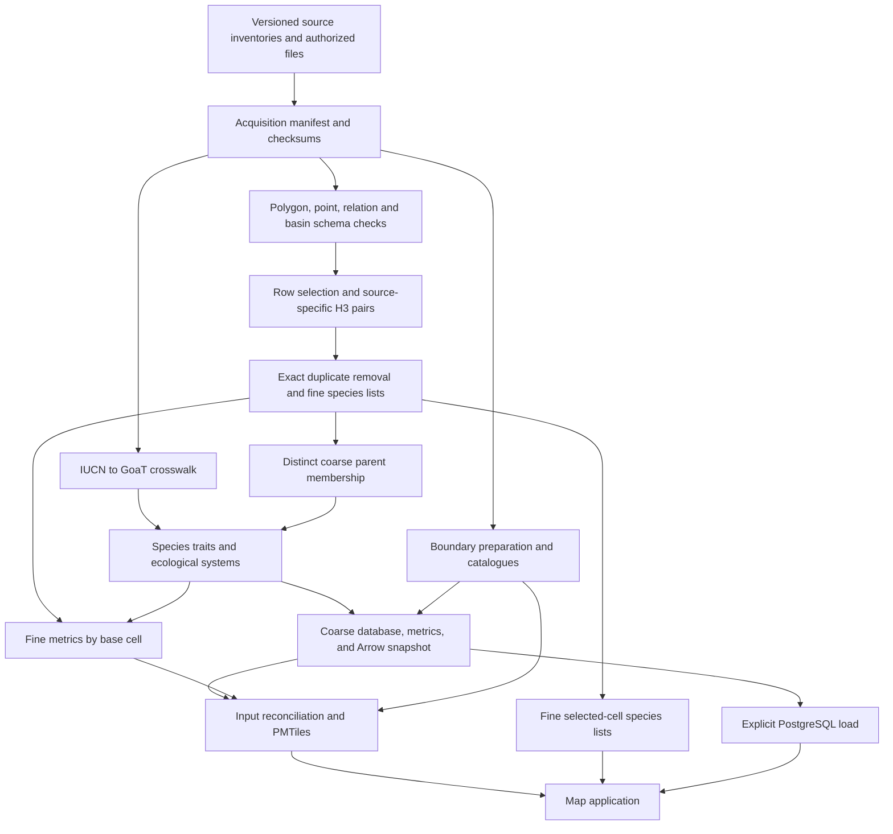

# Ark-IV data-pipeline methodology

**Review date: 4 September 2026. Status: implementation description and scientific assumption review.**

This document describes the supported pipeline in `ark_pipeline/`, its scientific
interpretation, and the implementation choices that can affect results. It
covers acquisition through the map and selected-cell API. It is not a claim
that the current dataset or prioritisation model has received independent
biological validation. The [roadmap assumption audit](docs/reference/roadmap_assumption_audit.md)
records findings, evidence, and outstanding acceptance criteria.

Code and versioned configuration describe executable behavior. Tests establish
behavior for their fixtures. Earlier performance reports describe particular
runs. None of those alone establishes biological accuracy. Where implementation
and intended policy differ, this document states the difference explicitly.

After the source disk became available, this review verified registered IUCN
and GoaT checksums and audited the complete metadata tables against the saved
September benchmark crosswalk. Dated results appear in the assumption audit.
This review did not rebuild global spatial outputs or estimate taxonomic match
accuracy. Earlier performance/geometry results remain separate recorded evidence.

## Contents

1. [Scientific question and units](#1-scientific-question-and-units)
2. [Pipeline and artifact flow](#2-pipeline-and-artifact-flow)
3. [Sources and acquisition](#3-sources-and-acquisition)
4. [Identities and taxonomy matching](#4-identities-and-taxonomy-matching)
5. [Spatial row selection](#5-spatial-row-selection)
6. [Geometry validation and transformation](#6-geometry-validation-and-transformation)
7. [H3 coverage and simplification](#7-h3-coverage-and-simplification)
8. [Pair reduction and coarse aggregation](#8-pair-reduction-and-coarse-aggregation)
9. [Species metadata and ecological systems](#9-species-metadata-and-ecological-systems)
10. [DNA representation and assembly quality](#10-dna-representation-and-assembly-quality)
11. [Priority scores and their interpretation](#11-priority-scores-and-their-interpretation)
12. [Boundaries and spatial filters](#12-boundaries-and-spatial-filters)
13. [Serving, tiles, and colour normalization](#13-serving-tiles-and-colour-normalization)
14. [Field lineage and intentional information reduction](#14-field-lineage-and-intentional-information-reduction)
15. [Resources and parallel execution](#15-resources-and-parallel-execution)
16. [Provenance, interruption, and publication](#16-provenance-interruption-and-publication)
17. [Benchmarks and estimated completion times](#17-benchmarks-and-estimated-completion-times)
18. [Validation and scientific acceptance](#18-validation-and-scientific-acceptance)
19. [Reproduction and maintenance](#19-reproduction-and-maintenance)

## 1. Scientific question and units

Ark combines mapped species ranges, Red List assessment metadata, and genome
project evidence to support exploration of **potential species richness and
configurable genome-sampling priorities**. It does not estimate abundance,
local extinction probability, habitat suitability, genetic diversity within a
population, or the expected conservation benefit of an intervention.

The basic spatial observation is a distinct pair `(resolution-7 H3 cell, IUCN
SIS species ID)`. A pair means at least one eligible source supplied membership:
an IUCN range or HydroBASINS polygon touches the cell under the selected profile,
or an IUCN point falls inside it. A species is counted once per cell regardless
of the number of source rows, seasons, evidence types, or overlap fragments that
produced the pair. The aggregate therefore represents potential mapped
occurrence. It is neither proof of occupancy throughout the hexagon nor a count
of observations.

An absence from the output means no eligible mapped coverage was produced from
the supplied sources. It is not an observed biological absence. Taxonomic,
geographic, assessment, and genomic database coverage are uneven. Comparisons
between cells therefore inherit source coverage and reporting biases.

Resolution 7 is the analytical membership grid; resolution 3 is an overview
obtained through the H3 parent relation. In the installed H3 library, average
hexagon areas are approximately 5.16 km² and 12,393.43 km² respectively. Actual
cell areas vary; these are not equal-area sampling units. See the official
[H3 cell statistics](https://h3geo.org/docs/core-library/restable/).
Neither resolution is a new claim about the precision of the underlying range
map. Counting these cells is not an IUCN Area of Occupancy calculation.

## 2. Pipeline and artifact flow



The arrows show dependencies, not a promise that all branches run concurrently.
`just data-build` coordinates acquisition, crosswalk refresh, pairs, lists,
metadata, metrics and tiles. `just data-update` first updates due sources.
`just data-prepare` continues from generated pairs; `just data-tiles` continues
from recorded prepared inputs. PostgreSQL setup/loading and starting the app
remain separate. See [the operational workflow](docs/pipeline/01_data_pipeline.md)
and [the code map](ark_pipeline/README.md).

| Stage | Main implementation | Principal evidence/output |
| --- | --- | --- |
| Acquire and register sources | `cli/sources_acquire.py`, `cli/sources_sync.py` | Immutable source records, active acquisition manifest, checksums |
| Census and source diagnosis | `spatial/census.py`, `cli/spatial_pairs.py`, `cli/benchmark_pipeline.py` | Polygon schema/CRS/census plus point, relationship and HydroBASINS checks |
| Taxonomy matching | `cli/crosswalk_match.py`, `cli/crosswalk_refresh.py` | Crosswalk, unresolved candidates, source summary, receipt |
| Spatial coverage | `spatial/coverage.py`, `cli/spatial_pairs.py` | Polygon/basin any-touch pairs, point-containing cells, audits and receipts |
| Deduplication and lists | `aggregation/pairs.py`, `aggregation/species_lists.py` | Fine base-cell partitions, coarse lists, reconciliation |
| Species traits | `builders/species_metadata.py` | `species.parquet`, `species_systems.parquet`, build report |
| Coarse serving | `builders/source_database.py`, `builders/coarse_cache.py` | Validated source database, coarse metrics, inverse species coverage, Arrow |
| Fine serving metrics | `aggregation/metrics.py`, `builders/fine_metrics.py` | Metric partitions and dependency receipts |
| Boundaries | `builders/boundary_frameworks.py`, `builders/administrative_boundaries.py` | Geometry, memberships, catalogues, coverage reports |
| Reconcile and compile | `cli/serving_prepare.py`, `cli/serving_tiles.py` | Prepared-input record, PMTiles generation and metadata |
| Application reads | `backend/`, `frontend/src/lib/` | Species API, cell details, static/dynamic maps |

Implementation paths in this table are relative to `ark_pipeline/` unless a
full repository directory is named.

## 3. Sources and acquisition

The authoritative inventory is [config/data_sources.toml](config/data_sources.toml),
with release-specific inventories alongside it. “Required for acquisition” and
“used by the present analytical build” are different states.

| Source | Current role | Important limit |
| --- | --- | --- |
| IUCN taxonomy and assessments | Species identities, names, category, assessment identity, systems | Assessment date/scope and spatial release must remain compatible; a latest-assessment selection is not automatically inferred |
| IUCN polygon archives | Production spatial membership | Configured 2026-1 inventory has 30 archives; mapped coverage is not all described life |
| IUCN point archives | Production spatial membership at the containing resolution-7 cell | Configured 2026-1 inventory has 17 archives; points are unbuffered and uneven sampling effort is not corrected |
| IUCN HydroBASINS relation tables | Production species-to-basin membership | Configured 2026-1 inventory has 14 archives; relations depend on an exact v1c `HYBAS_ID` join |
| HydroBASINS v1c | Production geometry for referenced basin relationships | Basin polygons are distribution units, not direct observations or hydrological habitat-suitability models |
| GoaT | Taxonomy-linked sequencing/project/assembly attributes | Missing evidence, inferred values, and project progress require distinct interpretation |
| NCBI Taxonomy | Scientific names, synonyms, lineage, merged/deleted IDs | Taxonomic concepts can differ from IUCN concepts |
| GBIF Backbone | Optional serving identifier enrichment; configured acquisition dependency | Pinned legacy backbone is not the same as the independently cached GBIF/CoL review service used in historical enrichment |
| Optional EDGE table | Group label joined through IUCN ID | Neither an EDGE score nor a required pipeline input |
| Natural Earth, Marine Regions EEZ, geoBoundaries, RESOLVE | Boundary context and filtering | Provider versions, territorial conventions, simplification, and missing countries affect scope |
| Bird-provider and protected-area data | Not complete production integrations | Availability, authorization, schema and analytical semantics remain open |

Public downloads use staging, validation and recorded identities; managed
registration changes only after source validation succeeds. IUCN access uses
the account holder's authorized provider workflow. The code does not turn a
successful download into permission for public redistribution. The
[publication checklist](docs/publication_checklist.md) and [NOTICE](NOTICE.md)
remain the project records for release review; this document is not a legal
clearance.

Updates use configured releases, intervals, HTTP validators where useful, and
checksums. A configured release is not an automatic guarantee that the latest
provider release has been discovered. Without the optional authenticated IUCN
catalogue, the operator must check release changes. Pinning an input hash proves
which bytes were used, not that different providers describe the same date.

### GoaT extraction choices

The downloader queries the Eukaryota tree rooted at TaxID 2759, includes lineage
and estimates, uses ordered pages of up to 9,990 records, and checks record
counts and duplicate IDs. It checkpoints bytes and pagination state. The
coverage-providing `genome_size` field is also exported as a trait.

Returned attribute arrays become semicolon-separated strings. Each field's
value is written to its TSV column, while every non-value key in the returned
field object is serialized under that field in `field_provenance_json`. The
request sets `include_estimates: true`; consumers must use the provenance data
rather than assume every value was directly measured. GoaT explicitly
supports both observed metadata and taxonomically inferred values; see
[Challis et al., 2023](https://pmc.ncbi.nlm.nih.gov/articles/PMC9971660/).

An unchanged row count during a live API download is not a transactional
snapshot guarantee. A provider index/release identifier or retained evidence
response is needed to establish stronger snapshot consistency.

The registered 30 August GoaT TSV contains 35 columns. The downloader now emits
its nine previously omitted fields: `assembly_span`, `chromosome_number`,
`haploid_number`, `genome_size`, `contig_n50`, `scaffold_n50`, `chromosome_count`,
`gene_count`, and `sample_location`, plus the provenance JSON column. These
fields are retained for audit even when the current score does not consume them.

## 4. Identities and taxonomy matching

**IUCN SIS ID is the application species identity.** Assessment IDs identify
assessments; GoaT/NCBI and GBIF IDs identify their own taxonomic records. Many
IUCN species mapping to one NCBI concept must not merge their ranges or Red List
categories. Spatial pairs and list packs explicitly use IUCN IDs.

The serving schema still uses the legacy name `gbif_accepted_id` for an IUCN
SIS-valued key. This is a compatibility alias, not evidence of a GBIF match.
Actual external links must use `gbif_taxon_id`, `goat_taxon_id`,
`iucn_sis_id`, and `iucn_assessment_id` as appropriate. The alias is remaining
technical debt against the [pipeline requirements](docs/reference/data_pipeline_change_requirements.md).

### Matching procedure

The matcher normalizes case and whitespace, restricts GoaT candidates to species
rank, generates current-name and authoritative synonym matches, reconstructs
lineage, ranks candidates, and writes accepted and unresolved decisions
separately. Names alone are not sufficient biological evidence of equivalence.

The executable acceptance branches in `crosswalk_match.py` are:

| Candidate branch | Acceptance condition, in addition to being the top-ranked candidate |
| --- | --- |
| Exact GoaT/NCBI current name or authoritative synonym, unique candidate | At least two lineage agreements and at most one conflict |
| Exact-name/synonym branch with optional external validation | `gbif_confirmed` true, at least two lineage agreements and at most one conflict |
| GBIF accepted-name bridge | At least two lineage agreements, at most one conflict, and either a unique candidate or an agreement advantage of at least two over the runner-up |
| Near-name candidate | External confirmation, edit distance at most two, similarity at least 0.94, at least two lineage agreements, at most one conflict |
| Insufficient evidence | Accepted ID remains null; candidate evidence is retained for review |

All automatic branches now enforce the same minimum lineage evidence and
maximum-conflict guard. This correction was made after the September audit;
it deliberately sends previously accepted conflicting exact-name rows back to
the unresolved queue. It improves consistency but does not establish match
precision, which still requires independent review.

`safe_for_automatic_species_trait_transfer` means an accepted match maps to only
one IUCN species within the supplied crosswalk. It protects against detected
split/lump relationships; it does not prove that the match is correct or that
an assembly belongs to the same biological concept. The label `AI-review
(GPT-5.6 Sol)` records the implemented review-policy label, not independent
human expert sign-off on each automatically generated row.

Automatic refresh uses registered IUCN, GoaT and NCBI snapshots. It does not
silently reuse old optional GBIF/lineage review files. Historical enriched
coverage of 126,285/171,604 species (73.59%) is therefore not the expected
coverage of a fresh deterministic run, and neither percentage estimates match
precision. A stratified independently reviewed reference set is still needed.
See the [crosswalk history and workflow](docs/pipeline/06_iucn_goat_global_crosswalk.md).

The audited September benchmark crosswalk, whose IUCN/GoaT hashes match the
registered sources, contains 122,392 accepted links among 171,604 IUCN IDs
(71.3223%), with 122,004 safe-transfer flags. It has 16,233 accepted rows with
two or three recorded lineage conflicts. These conflicts can include different
rank names/conventions between taxonomies and are not themselves a measured
misidentification rate. They demonstrate that acceptance does not mean zero
lineage conflicts and identify a population for expert review.

Assessments are joined by IUCN identity; the matcher does not select the newest
assessment or resolve conflicting regional/global assessments by an explicit
ranking rule. Managed refresh checks identity reconciliation and rejects
duplicate identities rather than silently choosing among them. Input scope
must be established before treating the output as a consistent assessment set.
The supplied tables have 171,604 unique taxon IDs and one assessment per ID;
all recorded scope strings include `Global`. Publication years range from
1996 to 2025 despite the acquisition manifest's 2026-1 release label. This does
not alone prove a wrong release, but the manifest label must not be mistaken
for a recent assessment of every species.

## 5. Spatial row selection

The default is [iucn-richness-any-touch-v3](config/spatial_semantics_iucn_richness_v3.toml).

| Attribute | Admitted values |
| --- | --- |
| Presence | 1: extant; 4: possibly extinct |
| Origin | 1: native; 2: reintroduced; 6: assisted colonisation |
| Seasonality | 1: resident; 2: breeding; 3: non-breeding; 5: uncertain seasonal occurrence |

These values match IUCN's published 2021-onwards richness selection. IUCN's
published products nevertheless use different grids, taxonomic selections and
marine/coastline handling. Matching attribute codes does not make Ark's maps
numerically equivalent to those products. IUCN also distinguishes raw range
maps from habitat-refined maps. [IUCN richness methodology](https://nrl.iucnredlist.org/resources/sr-rwr-archive).

The alternative [v2 profile](config/spatial_semantics_any_touch_v2.toml) accepts
Presence 1 and Origin 1 or 2 without a seasonality restriction and without
decision simplification. It narrows the mapped-range selection but still does
not establish confirmed occupancy. Choosing v2 also changes row eligibility;
it is not a clean simplification-only comparator for v3.

The same Presence, Origin, and Seasonality policy is applied to polygon, point,
and HydroBASINS relationship rows. Polygon exclusion precedence is missing
species ID, missing geometry, disallowed presence, disallowed origin, then
disallowed seasonality. Point rows additionally reject null or out-of-range
WGS84 coordinates before the attribute policy. Relationship rows reject a null
or non-positive `hybas_id` before the attribute policy. A row failing several
conditions receives the first applicable reason. Null and unrecognized codes do
not acquire a permitted meaning automatically. Invalid but non-null polygon
geometry is processed by the geometry policy, rather than treated as missing.

Breeding and non-breeding records are unioned at the species/cell level. The
result does not represent simultaneous occupancy in one season. The pair/list
schema has neither season nor evidence-type dimensions; seasonal analyses or a
point-versus-range display require a separate provenance-preserving product.
Overlap and observation multiplicity are removed and do not become abundance.

## 6. Geometry validation and transformation

### Coordinate assumptions and census

The source diagnostic requires EPSG:4326 and the fields `id_no`, `presence`,
`origin`, and `seasonal`. Coordinates used by Shapely are longitude/latitude;
H3 boundary APIs that return latitude/longitude are explicitly reordered.
The present preparation does not infer an unknown CRS or silently reproject it.
Shapely validity, clipping and area computations here operate in a planar
longitude/latitude representation; they are not ellipsoidal area measurements.

The census reads native GDAL envelopes and streams attributes joined by source
FID. It disables ring organization only while reading envelopes and restores
the process-global GDAL setting afterward. Bounds need all ring coordinates,
not shell/hole reconstruction. Duplicate or unmatched FIDs fail; exceptional
null, empty or degenerate envelopes use the geometry-reading path. This saves
WKB materialization and topology work for the census. It does not validate the
biological range or replace normal geometry decoding during coverage.

### Point coordinates

Point archives are streamed directly from their ZIP members with Arrow. An
eligible finite `dec_lat`/`dec_long` coordinate in the closed ranges `[-90, 90]`
and `[-180, 180]` is converted vectorially to its single containing resolution-7
cell. No uncertainty radius, precision-dependent buffer, kernel density, or
survey-effort weight is applied. Multiple points for the same species and cell
collapse during the common pair reduction. This preserves a membership signal,
not point count, sampling intensity, or local abundance.

### HydroBASINS relationships

Eligible IUCN table rows are first reduced to distinct `(hybas_id, IUCN SIS ID)`
relationships with DuckDB's spillable sort. The numeric HydroBASINS identifier
encodes region and Pfafstetter level. For every referenced region/level, the
pipeline scans only the small DBF identifier/FID columns, then asks GDAL for the
WKB of referenced FIDs. Each referenced HydroBASINS v1c polygon is covered once
with the same any-touch polygon kernel and cached as `(hybas_id, H3 cell)`.
Species pairs are produced by a native DuckDB join to that reusable basin index.
Missing referenced IDs fail the stage instead of silently dropping species.

### Repair policy

`prepare_geometry` retains polygonal members, rejects missing/empty polygonal
coverage, and measures planar area. Valid geometry is retained. Invalid geometry
is passed to `shapely.make_valid`, after which only polygonal members are kept.
The current call uses Shapely's default repair method rather than explicitly
selecting a method keyword. With installed Shapely 2.1.2 this is `linework`;
repairs can produce mixed-dimensional output. [Shapely repair documentation](https://shapely.readthedocs.io/en/stable/reference/shapely.make_valid.html).

Both active profiles reject repair when the result is empty/invalid, when a
zero-area original becomes positive-area, or when

```text
abs(repaired_planar_area - original_planar_area) / abs(original_planar_area) > 0.05
```

The original validity issue, repair method and relative area change are audited.
Lines or points remaining after repair do not become separate occurrence data.
The 5% guard is an implemented engineering threshold, not an approved biological
error allowance. It uses net planar area change: additions and removals can
cancel, and a small percentage of a huge range can conceal loss of a critical
small population. It does not measure symmetric difference, local displacement,
or omitted/added H3 cells for each repaired geometry.

### Antimeridian handling

A component is a separate polygonal piece of a multipolygon. A hole is an
excluded interior region of one such piece. Neither is a computational tile.
The transform first checks whether adjacent ring longitudes jump by more than
180 degrees. Already-continuous polygons are retained unchanged. For genuine
crossings, it unwraps the shell and each hole, considers whole-world longitude
translations, and accepts a hole placement only when exactly one copy lies
inside its shell. Invalid or ambiguous transformed results fail explicitly.

The corrected September 2026 implementation no longer shifts holes toward the
shell's vertex-average longitude. That former rule moved 306 holes outside a
valid global shell. The preceding fixture check retained all 997 eligible
prepared geometries byte-for-byte; the extreme source retained its 36 components
and 23,096 holes. This establishes correction of that transform defect, not
that all future source geometries or subsequent simplifications are accurate.

A source that becomes invalid through our transformation is a software defect
to investigate. Repairing it again merely to silence the error would obscure
which biological geometry was intended.

## 7. H3 coverage and simplification

### Explicit membership definition

For each selected range or HydroBASINS polygon, let `G` be the prepared decision geometry and `H(c)`
the closed cell polygon. The intended membership rule is:

```text
include cell c exactly when G intersects H(c), including edge or vertex contact
```

The pipeline uses h3ronpy's native `geometry_to_cells` with
`ContainmentMode.IntersectsBoundary` on clipped pieces, followed by a union of
cell IDs. It does not use cell-centre containment as the final rule, require a
whole cell inside the range, or apply a production border-expansion buffer.
The profile's `candidate_mode = "bbox_overlap"` is a retained configuration
label; the current production call actually uses `IntersectsBoundary`.
Historical hierarchy/candidate-buffer settings are not proof that those
experimental routes execute in the active direct kernel.

Official H3 distinguishes centre, whole-cell and overlap modes. The binding
also documents `Covers` separately for very small polygons. Therefore behavior
must be checked with the installed binding and fixtures, not inferred solely
from enum names. In this review, three tiny valid polygons inside single cells
returned the expected cell under installed h3ronpy 0.22.0; edge/vertex and hole
boundary regression fixtures also exercise the intended contract.
[H3 region functions](https://h3geo.org/docs/api/regions/) and
[h3ronpy modes](https://h3ronpy.readthedocs.io/en/latest/api/core.html).

### Computational partitioning

The geometry is intersected with a regular degree grid. Pieces are shifted to
a canonical longitude copy before native filling. Repeated seam cells are
removed by numeric sorting and uniqueness. Grid sizes are 10° below 100 deg²
of bounding-box area and **2.5°**, not 2°, at or above that threshold.

Bounding-box area is a workload-routing variable. It is neither species range
area nor km²; a dispersed multipolygon can have a large envelope and very
little occupied area. Degree tiles have different physical sizes at different
latitudes. Partitioning is intended to preserve coverage and is distinct from
boundary simplification. Historical comparisons found equal cell sets on 50
tested tail polygons, but that is a measured sample rather than a global proof.

### Decision simplification

| Parameter | Default v3 value | Interpretation |
| --- | --- | --- |
| Activation | Bbox area at least 100 deg² | Large-range routing threshold |
| Tolerance | 0.01° | Shapely coordinate-space simplification tolerance |
| Reported scale conversion | 111,693.98 metres/degree | Conservative local WGS84 scale used by the implementation |
| Computed tolerance budget | 1,116.9398 m | Tolerance multiplied by the scale constant |
| Configured maximum budget | 2,000 m | Profile-load check, not a measured per-cell error |
| First attempt | `preserve_topology=False` | Faster candidate |
| Acceptance | Nonempty polygonal, valid, unchanged component count | Structural guards |
| Fallback | Try `preserve_topology=True`, then retain original if rejected | Whole-geometry fallback |

Shapely uses Douglas–Peucker simplification, and topology preservation adds
checks against collapses and ring intersections.
[Shapely simplification](https://shapely.readthedocs.io/en/stable/reference/shapely.simplify.html).
The fast candidate may remove holes while preserving the number of outer
components. Equal component count does not establish that each original
component survived unchanged or that no merge/split compensated another.
There is no explicit hole-count acceptance gate.

The reported metre budget is derived from the configured tolerance. Routine
builds do not measure a geodesic boundary displacement or an unsimplified H3
comparison for every row. It must not be described as a proven ecological
accuracy of 1.12 km. Simplification can add and omit cells, particularly around
holes, narrow ranges and boundaries; valid geometry alone does not certify an
acceptable effect. In v3 the any-touch rule applies to the accepted simplified
geometry for affected rows, so it is approximate relative to the original map.

Earlier calibration reported 113,377 omissions and 38,446 additions across
57,410,051 reference cells for 50 tail geometries. Those aggregate percentages
can hide large relative errors for individual species. They are historical
measurements, not universal error guarantees. The current profiles have a
displacement budget but no explicit per-species false-negative/false-positive
acceptance limits. Following the transform correction, the calibration should
be repeated with the same v3 row selection and simplification disabled for the
reference. See [the detailed experiments](docs/performance/spatial_hierarchy_and_simplification_benchmark.md).

Simplifying components independently and retaining rejected components is a
possible future optimization. It is not implemented or scientifically approved
by this review. Any new policy must also check interactions after reassembly.
A valid nonempty geometry producing zero cells causes a build failure.

## 8. Pair reduction and coarse aggregation

Every source type reaches the same two-column contract: `uint64` H3 index and
IUCN SIS ID. A point supplies one raw pair; a selected range supplies its covered
cells; a basin relationship joins a species to the cached cells of that basin.
Raw archive outputs can repeat a pair across rows and evidence types.
Reduction partitions by H3 base cell, uses DuckDB's spillable numeric sort, and
removes adjacent duplicate pairs with Arrow/NumPy, including across batch
boundaries. One unfinished cell is carried forward so a list is never cut into
separate output records by a reader batch boundary.

The fine relation is a set. Reconciliation requires:

```text
raw pair rows = unique fine relationships + exact duplicate pairs removed
unique fine relationships = sum(length(species_ids) for every fine cell)
```

IDs are not deduplicated by a GoaT or GBIF match. Lists contain IUCN identities.
Null keys, wrong encoded resolution/base-cell placement, unsorted streams and
unexpected duplicates fail relevant checks. These structural checks are not a
complete proof of arbitrary external H3 bit-pattern validity; source validation
and native generation are also part of the contract.

Coarse membership is derived as a distinct set:

```text
coarse_pairs = DISTINCT (parent_at_resolution_3(fine_cell), species_id)
```

Consequently, a species found in 50 children contributes one species to the
parent's richness, not 50. Coarse scores are recomputed from the coarse species
set; they are not the sum of child-cell scores. Vectorized parent-bit operations
are used for efficiency and must remain equivalent to the H3 API.

H3 parenthood is exact logically but approximate geometrically: a child hexagon
need not lie wholly inside its parent's drawn hexagon. A coarse cell therefore
means “at least one included fine cell has this parent,” not “the species
occupies the whole coarse polygon.” [H3 hierarchy](https://h3geo.org/docs/highlights/indexing/).

Outputs are `(h3_cell UBIGINT, species_ids BIGINT[])`, partitioned by base cell
at resolution 7 with one coarse list product. The normal workflow avoids
materializing a separate globally deduplicated flat pair file. Diagnostic
finalization retains that alternative route.

## 9. Species metadata and ecological systems

Metadata joins the crosswalk to GoaT traits and to IUCN assessment systems.
Species present in H3 lists but absent from metadata are retained as explicit
`IUCN taxon <ID>` placeholders with unknown external IDs, `Not Assessed`, and
GoaT-data-deficient status. This preserves relationships, but does not recover
missing biology. All-system richness can contain placeholders with no
terrestrial, freshwater or marine classification.

Systems are species-level labels. Assessment text beginning with `Freshwater`
is normalized to `Freshwater`; `Terrestrial` and `Marine` are retained.
Unrecognized/absent labels do not get an invented system. A species may belong
to more than one system. System-specific counts may therefore overlap and
must not be added to reconstruct the all-system total.

The builder applies a species' system label to its mapped membership. It does
not geographically divide an amphibious species' range into water and land,
mask it by habitat, filter by altitude, or distinguish occupied habitat within
a broad range. “Marine layer” means mapped species classified as marine, not
a precise raster of marine habitat occupancy.

Optional GBIF enrichment accepts a unique accepted-species canonical-name
match in the supplied backbone when a crosswalk bridge ID is unavailable.
That fallback does not apply the full crosswalk lineage review and merits its
own identifier-quality check. EDGE enrichment chooses a group row ordered by
numeric EDGE rank and group name for an IUCN ID. It exposes a label; it does
not compute evolutionary distinctiveness or use an EDGE score in priority.

## 10. DNA representation and assembly quality

### Exact implemented evidence rule

The current `has_qualifying_dna_evidence` predicate is true if any of these holds:

- `sample_acquired` is a nonempty string;
- `in_progress` is a nonempty string;
- `ebp_standard_criteria` is a nonempty string; or
- `assembly_level` is chromosome/complete genome and numeric BUSCO completeness
  is at least 90.

The strings are tested for presence, not parsed into a validated status
vocabulary. This review has not established that malformed or false-like
strings occur in the current source. The implementation would nevertheless
need explicit normalization to distinguish them. `resampling_required` and
`sequencing_status` are read but do not override this predicate. Several other
acquired project-status fields are also not used in it.

The registered GoaT snapshot has 2,138,975 unique taxon records, including
1,795,920 species-rank records. Of these species, 19,565 meet the current
qualifying predicate. No `false`, `no`, `0`, or `unknown` string was found in
the two checked project fields. The original benchmark crosswalk gave 5,855
linked species safe qualifying evidence and 39 nonempty resampling entries. The
corrected fresh crosswalk gives 5,217 represented species and 35 resampling
entries. All 35 contain `DTOL`; 11 also have qualifying chromosome/BUSCO
evidence, while 24 have project/sample-stage evidence only. The raw marker is
retained as `goat_resampling_required`, but does not silently erase an existing
assembly.

For ordinary species, automatic trait transfer additionally requires a safe
crosswalk link. Missing accepted TaxID or missing GoaT trait row sets
`goat_data_deficient`. This flag means insufficient linked GoaT information;
it is different from IUCN's **Data Deficient** threat category.

### Findings requiring a revised biological specification

**Extinction is separate from DNA evidence.** Extinct and
Extinct-in-the-Wild categories no longer set DNA or lineage representation.
Any future extinction-specific priority policy must use its own explicit field
and rationale. The supplied assessment/crosswalk set contains no EX/EW rows,
so this correction changes future or differently selected inputs rather than
the audited snapshot.

**Coverage universe.** A genus/family is now marked represented from every
qualifying species-rank row in the acquired GoaT tree, regardless of whether
that representative is itself in the IUCN crosswalk. This allows a
less-threatened or unassessed relative to represent a lineage. The fresh rebuild
found 587 candidate family names covering 11,434 species. Current NCBI
names/nodes resolve 585 of them, covering 11,427 species, to one family TaxID.
Gonostomatidae and Cepheidae resolve to multiple family TaxIDs and are rejected
from automatic lineage coverage. GoaT-data-deficient precedence and the
evidence-stage definition still affect the resulting priority bucket.

**Lineage identity.** Family names must resolve uniquely at family rank in the
registered NCBI names/nodes snapshot. Genus names must resolve uniquely at genus
rank and are qualified by family. Representative and target lineages are then
matched using normalized kingdom aliases (`Animalia`/`Metazoa` and
`Plantae`/`Viridiplantae`), family and genus. This prevents ambiguous rank names
from seeding representation while preserving explicit source-version evidence.

**Evidence stages.** A project acquiring a sample, work in progress, a public
assembly, and a reference-quality genome are different achievements. The
current union of these stages may be useful for avoiding duplicate sequencing
effort, but is too broad to mean “a completed usable genome exists.”

**EBP criteria evidence.** `has_ebp_criteria_evidence` requires safe transfer and a criteria string containing
`6.7` or `6.C`. It does not independently check all assembly requirements. The
January 2026 EBP standard includes accuracy and completeness requirements and
organism/material-dependent targets beyond this substring test. It cannot be
certified from the current predicate alone.
[EBP assembly standards, version 7](https://www.earthbiogenome.org/report-on-assembly-standards).
The audited crosswalk/GoaT join gives 2,398 species the current EBP flag; this
counts that predicate, not independently certified assemblies.

A revised specification should retain separate fields for sample availability,
project progress, public assembly, quality assessment, resampling need, direct
versus inferred evidence, source date, and uncertain taxonomic transfer. Which
of those reduces sampling priority is a biological/project-management choice.

## 11. Priority scores and their interpretation

The default species score is the product of a Red List category weight and a
DNA-representation weight. The cell score is the sum over distinct species in
the selected system:

```text
species_priority(s) = threat_weight(s) * dna_weight(s)
cell_priority(c) = sum(species_priority(s) for s in species_set(c))
normalized_priority(c) = cell_priority(c) / richness(c), when richness(c) > 0
```

| Red List category | Default weight |
| --- | ---: |
| Critically Endangered | 4 |
| Endangered | 3 |
| Vulnerable | 2 |
| Near Threatened | 1 |
| Data Deficient | 2 |
| Least Concern | 0.1 |

| DNA bucket, tested in this precedence order | Default weight |
| --- | ---: |
| GoaT data deficient | 4 |
| No represented family | 4 |
| Family represented, genus unrepresented | 3 |
| Higher lineage represented, species unrepresented | 2 |
| Remaining sampled/represented case | 0 |

GoaT-data-deficient status takes precedence over family/genus flags. In the
aggregate SQL, `IS DISTINCT FROM false` gives some nullable inputs a different
meaning from explicit false; canonical metadata normally supplies booleans.
Tests compare the native reducer with the SQL predicates, including null cases.

The six threat categories and five DNA buckets yield 30 joint counts per
system. Eleven summary counts plus these 30 joints give 41 metrics per system,
or 164 across `all`, `Terrestrial`, `Freshwater`, and `Marine`. Joint counts
preserve the exact sum-of-products for changed user weights; separate marginal
threat and DNA counts would not. For example, two cells with the same numbers
of threatened and unsampled species can have different scores if the unsampled
species are the threatened ones in only one cell.

These weights are configurable project heuristics, not estimated extinction
probabilities, monetary benefits, or an empirically validated optimal allocation.
Giving DD the same weight as VU is a priority policy, not evidence they have
equal risk. IUCN describes DD as insufficient evidence for assessing threat,
not a threat category. [IUCN category definitions](https://www.iucn-seahorse.org/the-iucn-red-list/red-list-categories).

Species in categories outside the six scoring predicates can still contribute
to richness while contributing zero to this score. A sampled species receiving
zero does not imply that it has no conservation value. A high score may partly
reflect poor GoaT linkage rather than genuine lack of genetic material.
The builder maps the explicit legacy labels `Lower Risk/near threatened` and
`Lower Risk/least concern` to their same-named modern buckets. It does not infer
a modern category for `Lower Risk/conservation dependent`; the build report
counts those unscored rows explicitly. The inspected snapshot contains 455,
169 and 121 species in those three legacy categories respectively.

The sum rewards richness as well as average species priority. Dividing by
richness produces the mean included-species priority, not area-normalized
priority, rarity-weighted richness, or a correction for incomplete sampling.
Scores do not incorporate population trends, abundance, survey effort,
accessibility, costs, legal feasibility, evolutionary branch lengths, or
complementarity between candidate sampling locations.

Before recommending real sampling locations, compare rankings across defensible
weight sets and DNA definitions, assess taxonomic coverage effects, and evaluate
against independently chosen conservation/genomics objectives. Agree those
objectives before choosing an “optimal” weight set.

## 12. Boundaries and spatial filters

Boundary geometry is separate from species range geometry. A spatial index
finds all boundary polygons intersected by each H3 cell; edge/corner touches
count. A border cell can belong to several administrative areas. Empty
membership is not an inferred country assignment.

Country scope combines Natural Earth land with matching Marine Regions EEZ
memberships. This is a chosen analysis scope, not a biological range extension
or a resolution of disputed sovereignty. The EEZ selector is hidden to avoid
duplicating country scope, while EEZ remains available for location context.

Municipal/local boundaries use pinned geoBoundaries ADM2 inputs where installed.
The recorded installation has 49,308 areas in 180 available countries, with
coverage gaps and source-specific corrections recorded. ADM2 may mean a county,
district or another second-level unit; it does not consistently mean municipality.
The code-only fallback has 426 areas in Denmark, Germany and Sweden. The roadmap's
former statement that only that preview exists was outdated. Provider-simplified
boundaries are used for filtering, so membership is relative to that source
version and geometry. See [boundary decisions](docs/reference/boundary_filtering.md).

Selections within a framework form a union; different frameworks intersect.
The species table uses coarse memberships and species lists for this spatial
scope. This is **cell-based filtering**, not a new exact range-versus-selected-
boundary intersection. If a cell touches a species range on one side and a
municipality on the other, both memberships can be true without the range
intersecting the municipality. Coarse cells amplify this distinction.

Similarly, a cell can touch two selected frameworks in disjoint parts. Filtering
by both tests cell membership in both, not the existence of a single point in
the intersection of the species range and both boundary geometries. Results
should be described as species associated with selected cells, not confirmed
municipality occurrences. Exact jurisdiction inventories need a separate
geometry-level validation/product.

## 13. Serving, tiles, and colour normalization

PostgreSQL holds species metadata, coarse lists, inverse species-to-coarse-cell
coverage, boundary memberships, and app statistics. Fine metrics and selected-
cell species lists remain separate partitioned Parquet products. The legacy
expanded `cell_species` relation supports small/compatibility builds; global
builds avoid expanding tens of billions of relationships into PostgreSQL.

Fine metrics evaluate predicates once per species, gather those flags by numeric
ID, and reduce within Arrow lists with NumPy. This avoids a full expanded SQL
relationship join while retaining the canonical metric definitions. Input is
batched at 256 cells with a 250,000-relationship target; an individual cell is
not split. Output buffers are bounded. Missing metadata maps to zero flags in
the reducer, but publication reconciliation must reject the resulting missing
relationships rather than silently publish reduced totals.

The coarse map uses a compact Arrow snapshot. PMTiles features carry cell ID,
resolution, compact metric names, system prefixes, and delimiter-encoded
boundary memberships. The managed compiler streams GeoJSON sequences into
Tippecanoe without materializing a global GeoJSON file. It disables feature and
tile-size limits and preserves input order; it does not promise pixel-perfect
source geometry at every zoom. Tile geometry is a display representation, not
the authoritative pair relation. Current build zoom ranges are 0–6 for coarse
features and 8–12 for fine features; frontend transition behavior is a separate
rendering concern.

The default export is one streamed compilation; optional base-cell shards trade
extra storage and a merge pass for checkpoint reuse. Feature streaming can be
limited by Python boundary/feature work, database reads, or compiler
backpressure. Aggregate counts alone cannot identify the bottleneck.

A rendered aggregate is not a complete species list. Exact selected-cell
results require the matching raw fine list partition; missing partitions must
not be interpreted as an empty biological community. Generated products must
refer to the same prepared source generation.

### Display domains

Colour normalization does not change the stored biological membership or
priority formula. Metadata records global and boundary-specific score domains,
including per-species normalized domains at default weights. Within a framework,
selected domains are unioned; across frameworks the implementation uses the
smallest union maximum. Missing or invalid required metadata raises an error.

The frontend can instead derive domains from rendered coarse cells, committed
dynamic fine cells, or collected static tile values. Therefore displayed
colours may depend on resolution, selected scope, current weights, and loaded
cells. A local colour is not an absolute cross-region priority rank, and the
intersection of precomputed domain ceilings is not necessarily the exact
extrema of the geometrical intersection. The numeric score and domain should
accompany comparative figures.

## 14. Field lineage and intentional information reduction

The pipeline preserves the selected species/cell relation through its aggregation
and joins. It does **not** preserve all source fields in every serving artifact.
The following inventory identifies current important dispositions. It is a
reviewed field-group map, not the missing automated column-by-column audit of
every upstream release.

| Source field/group | Transformation and retained location | Serving loss or interpretation |
| --- | --- | --- |
| Polygon `id_no` | IUCN SIS key in pairs, lists, row audit | Source-specific identity preserved; legacy serving alias remains |
| Polygon `presence`, `origin`, `seasonal` | Selection plus raw values in row audit | Not retained as independent dimensions in cell lists/metrics |
| Archive, layer, source FID | Row audit tied to source receipt | Pair union does not retain which individual row supplied every membership |
| Original geometry and remaining polygon attributes | Original registered archives; selected geometry diagnostics in row audit | Full geometry/attributes are not copied into every pair or served cell |
| Repair validity and relative area delta | Row audit | Does not contain a complete per-repair biological impact measurement |
| Simplification method, rejection reasons, coordinate counts, budget | Row/benchmark audit | API metrics do not carry per-species boundary uncertainty |
| Point `id_no`, `dec_lat`, `dec_long` | Vectorized containing-cell pair; source bytes and per-member decision summaries retained | Coordinates and observation multiplicity are not served after pair union; no buffer or effort correction |
| Point `presence`, `origin`, `seasonal` | Row selection and per-member decision summaries | Raw values are not independent list/metric dimensions |
| Relationship `hybas_id`, `id_no` | Distinct basin/species table, then join to cached basin cells | Final lists do not identify which basin or evidence type supplied membership |
| HydroBASINS `HYBAS_ID` and polygon | Referenced-FID geometry read, basin-cell index and per-basin geometry audit | Non-key basin attributes and hydrological topology are not served |
| IUCN taxonomy IDs, names, ranks, authority | Matching tables/crosswalk; subset in species dimension | Full taxonomic lineage is not exposed in each serving record |
| Taxonomy `infraType`, `infraName`, `infraAuthority`, `subpopulationName`, `taxonomicNotes` | Present in registered taxonomy source | Not retained as separate matching/serving dimensions by the current matcher |
| Assessment ID, category, year, date, scope | Crosswalk; ID/category reach species dimension | Dates/scopes are not separate metric dimensions |
| Assessment systems | Split and normalize into species-system relation | Unrecognized values not classified; no geographic habitat masking |
| Population trends, threats, habitats, elevation and other unused assessment columns | Remain in original source if supplied | No current score or serving dimension inferred from them |
| Assessment `redlistCriteria`, `criteriaVersion`, `language`, `rationale`, `population`, `range`, `useTrade`, `conservationActions`, `realm`, `yearLastSeen`, `possiblyExtinct`, `possiblyExtinctInTheWild` | Present in registered assessments | Not independent current metric/score inputs; `possiblyExtinct` is distinct from a polygon's Presence code |
| GoaT species TaxID, names and lineages | Matching, trait join, and lineage-qualified representation lookup; candidate family/genus names must resolve to one TaxID at that rank in the registered NCBI taxdump | Coverage joins use normalized lineage names after rank/identity validation; they do not transfer traits from higher-rank records |
| `sample_acquired`, `in_progress`, `assembly_level`, `busco_completeness`, `ebp_standard_criteria` | Reduced to representation/quality flags | Different evidence stages collapse; detailed values not served |
| `resampling_required`, `sequencing_status` | Read by trait builder; resampling marker retained as `goat_resampling_required` | Do not yet alter the qualifying-evidence predicate or score |
| `bioproject`, `insdc_submitted`, `published`, `sample_available`, `sample_collected`, `sequencing_status_ebp`, `other_priority`, `family_representative` | Acquired; some read by matcher | Not incorporated into the present priority formula |
| Extra nine registered GoaT columns listed in section 3 | Retained in existing registered TSV and emitted by the downloader | Not used in the current score |
| GoaT per-field origin/inference/evidence objects | Values remain ordinary TSV columns; all non-value keys are serialized in `field_provenance_json` | Preserved generically for audit; not yet interpreted by scoring |
| Crosswalk confidence, candidates, concept relation and safety flag | Crosswalk and unresolved queue | Most evidence is not carried to ordinary map features |
| GBIF identifier | Exact bridge or unique canonical-name enrichment | Not used to merge IUCN range identities |
| EDGE group/rank | Group selected by rank ordering | Group label only; numeric EDGE evidence not a score input |
| Boundary IDs, names, parent codes, licences, represented dates | Geometry/catalogues/coverage reports | Maps carry compact IDs, not every source attribute |
| Species-level flags and category | 164 system-specific metric counts | Exact reweighting supported; species identity requires list product |

Thus “lossless” is meaningful only with an object and transformation specified:
lossless deduplication of a set, lossless relationship preservation through a
join, or preservation of original source bytes. It is false as a blanket claim
that the serving application uses every source field or retains seasonal and
row-level provenance in aggregated lists.

## 15. Resources and parallel execution

Python orchestrates native GDAL/Arrow reads, GEOS geometry operations, h3ronpy's
Rust-backed conversion, DuckDB queries and Tippecanoe compilation. Much heavy
work is already native; replacing orchestration with Rust alone does not remove
geometry complexity, data volume or disk contention.

The shared worker default is approximately:

```text
max(1, min(8, logical_CPU_count,
           floor(total_RAM / 4 GiB), floor(available_RAM / 2 GiB)))
```

Stage CLI overrides take precedence, followed by an explicit shared CLI worker
count, stage environment settings, the shared environment setting, and automatic
selection. Metric/helper threads default to one to avoid multiplying nested
thread pools. Memory limits are per process and do not cap all Arrow, NumPy,
GEOS or compiler allocations.

Range and referenced-basin geometry processes and per-geometry tile helpers share a semaphore budget. A caller
holds one slot and may use spare slots for independent tile work. Larger tile
jobs use a bounded thread executor; small jobs stay serial. Source validation,
simplification, coordination, and final per-polygon deduplication can remain
serial. Eight configured workers do not guarantee eight busy cores at every
moment. The one-core snapshot of a final large polygon could reflect serial
work or the former per-polygon scheduling behavior, rather than a process-count
measurement error.

A full large polygon's output cell array is still materialized. Point CSVs are
streamed and converted in native vector batches. Large HydroBASINS relationship
tables are streamed to Parquet, deduplicated out of core, and joined without a
Python species/basin expansion; the basin-cell index is shared across all 14
tables. Bounded batches and queues do not make memory constant with respect to
one enormous geometry. DuckDB spill, scratch storage, retained generations, and
writer buffers must also be included in resource planning.

## 16. Provenance, interruption, and publication

Managed stages record source checksums, profile identity, relevant code and
library fingerprints, schemas and output checksums. Fingerprints are based on
the files each stage explicitly lists; developers must update those dependency
lists when adding result-affecting code. A dirty working tree or a passing
receipt alone is not a scientific approval.

Completed archive pairs and list/metric partitions can be reused after their
receipts match. Unfinished archives may restart. A readable Parquet file is not
sufficient evidence of compatibility. Changes to trait metadata invalidate
metric receipts even if spatial memberships are unchanged. Changing row policy,
geometry code or source inputs invalidates affected spatial products.

The direct aggregator reconciles archives, pair totals, duplicates and lists
before atomically selecting a new `serving/current` generation. Tile outputs
and metadata similarly move together into a generation. The last valid result
is preserved on managed failures. Publication of a local generation is separate
from updating a running database or publicly deploying restricted data.

`data-status` is intentionally cheaper than a complete checksum scan and can
report `present-unverified`. A source can be present without being current,
validated, authorized for redistribution, or scientifically suitable.

Fine aggregate receipt checks, explicit prepared-input records, and source-root
pinning reduce mixed-generation mistakes. Legacy serving roots and manually
supplied packs remain compatibility paths; their existence must not be mistaken
for proof that the current corrected pipeline produced them.

## 17. Benchmarks and estimated completion times

The benchmark uses a deterministic 1,000-polygon fixture stratified by
logarithmic bounding-box area, then applies the selected row policy. The saved
v3 run admitted 997 of those rows. A forced extreme is a stress case and must
not be used as an unbiased representative of its entire size band.

The fixture was originally sampled under v2. Reweighting against a v3 census
does not supply missing geometries from the v3-only population. The historical
row-policy audit found 1,856 v3-only rows; a v3-native sample is still needed.
Within-band means and population weights estimate work; bootstrap intervals
address sampled-polygon uncertainty, not all storage, concurrency or hardware
uncertainty. An assumed 80% worker efficiency is a planning assumption.

The benchmark harness measures polygon source I/O/census, full reference
matching, sample polygon pairs, lists, boundaries, metadata, coarse/fine metrics,
reconciliation and actual tile compilation. It does not yet sample point CSV
conversion, HydroBASINS relationship normalization, basin coverage, or the
basin/species join. Production dashboards therefore show measured work for
those phases but do not claim that the polygon-only ETA prior predicts them. A
small polygon sample can cover nearly all global fine cells, so later stages are
not necessarily small. The interrupted September run's tile stage cannot
establish a completed total or a full tile speedup.

The dashboard distinguishes whole-stage work from a query, polygon, partition
or compiler phase. Run remaining/finish time requires estimates for every
unfinished stage; a known subtotal is not a complete run estimate. Active-job
elapsed time and local progress constrain straggler estimates. Unknown phases
remain unknown; uneven tile costs make live ETA uncertain.

Prior selection currently checks a passed benchmark plus matching source and
spatial-profile hashes. Full code/hardware compatibility of a prior timing
model is a separate concern from output receipt correctness and must be reviewed
when algorithms change. Source/profile agreement alone does not guarantee
transferable performance after the antimeridian or concurrency changes.

Recorded performance examples are in the [performance index](docs/README.md#performance-evidence).
The extreme polygon took 740.76 s in the original run, 369.32 s with shared tile
parallelism before the transform fix, and 187.56 s with the corrected transform
and successful topology-preserving simplification. Only the parallelism-only
comparison preserved the original 69,370,937-cell array exactly; the corrected
run produced 69,313,101 cells. The 187.56 s result is a single-case timing, not
a global throughput forecast or a fresh unsimplified error calibration.

## 18. Validation and scientific acceptance

### Engineering checks

The supported tests exercise row-policy precedence, touch semantics, holes,
antimeridian handling, component retention, source receipt reuse, archive
reconciliation, list deduplication across batches, parent membership, identity
preservation, placeholder metadata, native-versus-SQL metric equality, metadata
invalidation, boundary membership, and interrupted output publication.
Frontend tests exercise boundary catalogue behavior and colour-domain rules.
The dated test outcomes and limitations are in the
[assumption audit](docs/reference/roadmap_assumption_audit.md#verification-performed).

Passing these tests means the selected fixtures behave as asserted. Some tests
assert current policy choices; a pass cannot turn those choices into scientific
evidence. Count reconciliation also
cannot detect every wrong-but-present taxonomic match or misplaced range.

### Required scientific review and acceptance evidence

1. **Define the use case.** Decide whether the product answers potential range
   richness, sampling coordination, completed-genome gaps, or conservation
   intervention priority. Do not use one label for all four.
2. **Audit source coverage and field lineage.** Enumerate actual source columns,
   row counts, exclusions, missing values, assessment scopes and source dates.
   Account explicitly for polygons, points, basins, birds, and sources acquired
   but unused. Compare point and basin source coverage by taxonomic/geographic group.
3. **Validate taxonomic transfer.** Independently review a stratified sample of
   accepted, ambiguous and unmatched records, including homonyms and split/lump
   concepts. Report precision separately from coverage by taxonomic group.
4. **Specify DNA evidence.** Review project-stage meanings, quality
   requirements, inference provenance, resampling, and the
   universe used for genus/family representation. Quantify affected species and
   changes to cell rankings before revising the defaults.
5. **Calibrate geometry processing.** Use the corrected unsimplified kernel with
   the same row policy as reference. Cover small islands, narrow corridors,
   holes, disconnected pieces, poles/date lines and large global geometries.
   Report per-geometry omitted/added cells, relative rates, local displacement,
   zero-coverage failures and repair effects, as well as global totals.
6. **Set acceptance limits in advance.** No new numerical omission/addition
   thresholds are invented here. A conservation/GIS reviewer must agree limits
   appropriate to the intended scale, including treatment of small populations.
7. **Evaluate score sensitivity.** Measure rank stability under weights, evidence
   definitions, missingness treatment, spatial resolution and raw-versus-per-
   species normalization. Prefer independent conservation objectives to merely
   demonstrating that a preferred map is reproduced.
8. **Validate the deployment generation.** Run an authorized full build through
   tiles and serving, prove matching generations, measure resource use, and
   separately confirm the public synthetic-profile workflow.

Biological review should preserve source originals and distinguish deterministic
representation fixes from changes to the biological claim. A technically valid
repair can still be inappropriate; total area alone is not enough. Decisions
about removing an isolated component or filling a hole need local evidence or
an explicitly accepted approximation policy.

## 19. Reproduction and maintenance

Use UV for Python environments and Bun for JavaScript tooling. The installed
versions inspected for this review were Python 3.13, H3 4.4.2, h3ronpy 0.22.0,
Shapely 2.1.2, pyogrio 0.12.1, DuckDB 1.5.3, Arrow 24.0.0, and NumPy 2.4.6.
`uv.lock` and the frontend Bun lock capture package resolution; receipts also
need the actual native/dependency versions used by each run. GDAL/GEOS and the
external tile compiler matter to reproducibility beyond a Python package name.

From the repository root:

```bash
# Read-only planning and source readiness; requires the configured data disk.
just data-build --dry-run
just data-status --json
just spatial-doctor

# Explicit row-policy audit on authorized sources.
uv run python -m ark_pipeline.cli.spatial_audit --data-root /path/to/authorized-data

# Current end-to-end benchmark; expensive and writes an isolated run.
just data-benchmark --workers 4

# Focused implementation checks used in this review.
uv run python -m unittest tests.test_antimeridian_unwrap tests.test_spatial_pipeline tests.test_pair_aggregation tests.test_global_build tests.test_serving_metrics tests.test_refresh_crosswalk tests.test_global_metadata tests.test_global_adm2 tests.test_tile_export -q
bun test frontend/tests/mapDomains.test.ts frontend/tests/boundaryCatalogues.test.ts
```

For a same-policy unsimplified calibration, copy the v3 profile into an explicitly
identified reference configuration, set decision simplification to zero, and
retain the v3 row codes. Record both profile digests. Merely switching to v2
would confound geometry approximation with different eligibility rules.

The read-only metadata audit can be reproduced with
`uv run python -m scripts.audit_methodology --root /path/to/authorized-data --crosswalk /path/to/crosswalk/iucn_goat_crosswalk.parquet --output /path/to/local-audit`.
It checks source hashes, the crosswalk's source agreement and, when present,
the crosswalk/summary receipt. The inspected run's full report is saved locally
at `data/validation/methodology/2026-09-03/methodology-audit.json` and its main
results and hashes are recorded in the assumption audit. This command does not
perform a new taxonomic match, genome-quality certification, or spatial rebuild.

When changing a scientific or result-affecting implementation decision, update
this document and its assumption audit, the relevant configuration/fingerprints,
validation evidence, and affected roadmap entry. Preserve old results as dated
history. Do not edit old receipts to make new code appear compatible, and do not
mark a scientific review complete merely because an implementation test passes.
