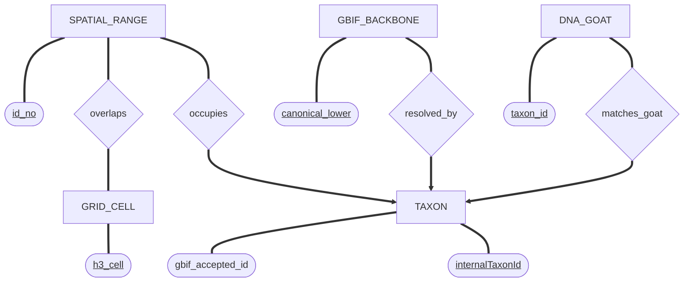

## Core Components of E/R Models
E/R models are conceptual tools used to describe a real-world enterprise in a way that is close to how people think about their applications.
### 1. Entities and Entity Sets
 * **Entity:** A real-world object that is distinguishable from other objects.
 * **Attributes:** Properties that describe an entity (e.g., an Employee has a name, SSN, and lot number).
 * **Entity Set:** A collection of similar entities, such as "all employees."
 * **Visual Representation:** Rectangles represent entity sets, and ovals represent attributes connected to them.
### 2. Relationships and Relationship Sets
 * **Relationship:** An association among two or more entities (e.g., "Dmitriy works at DIKU").
 * **Relationship Set:** A collection of similar relationships.
 * **Attributes on Relationships:** Relationships can also have their own descriptive attributes (e.g., "since" to track when an employee started in a department).
 * **Visual Representation:** Diamonds represent relationship sets, connected by lines to the involved entity sets.
## Defining Constraints
Constraints capture the semantics and rules of the data.
 * **Primary Keys:** Underline the attribute(s) in an oval that uniquely identify an entity within a set (e.g., **<u>ssn</u>**).
 * **Uniqueness Constraints (Many-to-One):** An arrow pointing from a relationship to an entity set indicates that each entity in the source set participates in at most one relationship. For example, an arrow from "Manages" to "Employees" means each department has at most one manager.
 * **Referential Integrity:** A thick arrow indicates that an entity *must* exist in that relationship (e.g., a department must have exactly one manager).
## Advanced Constructs
 * **Weak Entities:** These can only be identified uniquely by considering the primary key of an "owner" entity. They are represented by thick-bordered rectangles and diamonds.
 * **ISA Hierarchies:** Used for "is a" relationships, similar to class inheritance in object-oriented modeling. It is represented by a triangle labeled "ISA."
## Design Principles and Choices
When building your model, follow these three guiding principles:
 1. **Be faithful** to the application requirements.
 2. **Avoid redundancy** to prevent data entry errors and wasted space.
 3. **Strive for simplicity** for better clarity.
### Common Design Dilemmas
 * **Entity vs. Attribute:** Model a concept as an entity if it has its own structure (like an address with city and street) or if an entity can have multiple values for it (like several addresses per employee).
 * **Entity vs. Relationship:** If information (like a budget) is tied to a specific person regardless of which department they manage, it should be an attribute of a "Managers" entity rather than an attribute of the "Manages" relationship.

---

 # Few attributes

---

 # Many attributes

```mermaid
 flowchart TD
    T[TAXON]
    S[SPATIAL_RANGE]
    DG[DNA_GOAT]
    GB[GBIF_BACKBONE]
    GC[H3_GRID_CELL]

    R1{occupies}
    R2{matches_goat}
    R3{resolved_by}
    R4{overlaps}

    S === R1 ==> T
    DG === R2 ==> T
    GB === R3 ==> T

    S === R4 === GC

    T_PK([<u>internalTaxonId</u>])
    T_GBIF([gbif_accepted_id])
    T_K([kingdomName])
    T_C([className])
    T_F([familyName])
    T_G([genusName])
    T_SN([speciesName])
    T_RC([redlistCategory])
    T_TS([threat_score])
    T_DCS([dna_coverage_score])
    T_SP([sampling_priority])
    T_MM([match_method])

    T === T_PK
    T === T_GBIF
    T --- T_K
    T --- T_C
    T --- T_F
    T --- T_G
    T --- T_SN
    T --- T_RC
    T --- T_TS
    T --- T_DCS
    T --- T_SP
    T --- T_MM

    S_PK([<u>id_no</u>])
    S_SN([sci_name])
    S_TG([taxon_group])
    S_IG([iucn_grouping])
    S_Poly([geom_wkb])

    S === S_PK
    S --- S_SN
    S --- S_TG
    S --- S_IG
    S --- S_Poly

    DG_PK([<u>taxon_id</u>])
    DG_AL([assembly_level])
    DG_AS([assembly_span])
    DG_SS([sequencing_status])
    DG_SA([sample_available])
    DG_SC([sample_collected])
    DG_IP([in_progress])
    DG_IS([insdc_submitted])
    DG_PB([published])

    DG === DG_PK
    DG --- DG_AL
    DG --- DG_AS
    DG --- DG_SS
    DG --- DG_SA
    DG --- DG_SC
    DG --- DG_IP
    DG --- DG_IS
    DG --- DG_PB

    GB_PK([<u>canonical_lower</u>])
    GB_AID([gbif_accepted_id])
    GB_TR([taxonRank])
    GB_TS([taxonomicStatus])

    GB === GB_PK
    GB --- GB_AID
    GB --- GB_TR
    GB --- GB_TS

    GC_PK([<u>h3_cell</u>])
    GC_NS([n_species])
    GC_TP([total_priority])
    GC_TT([total_threat])
    GC_ND([n_no_dna])

    GC === GC_PK
    GC --- GC_NS
    GC --- GC_TP
    GC --- GC_TT
    GC --- GC_ND
```

