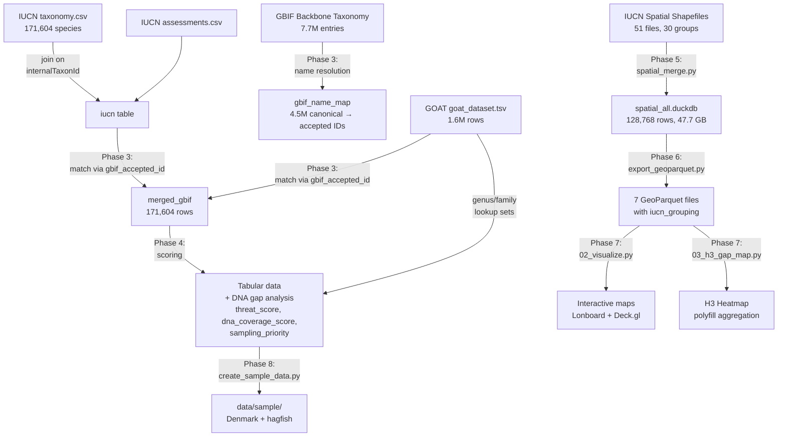

# Implementation Plan: Merging Biodiversity Datasets for DNA Gap Analysis

## Research Question

> *Where are the hotspots that have the most threatened species but where DNA has **not** been sampled?*

**Anchor dataset**: IUCN Red List (taxonomy + assessments)
**Spatial dataset**: IUCN Location Data (Polygons)

## DNA Coverage Reality

Combining GOAT against IUCN via GBIF backbone taxonomy reveals the scale of the gap:

| Match Level | IUCN Species Covered | % of 171,604 | Interpretation |
|-------------|--------------------:|--------------:|----------------|
| **GOAT matched** | 91,442 | 53.3% | In GBIF and found in GOAT |
| **In GBIF, not in GOAT** | 77,908 | 45.4% | In GBIF but no DNA data |
| **Not in GBIF** | 2,254 | 1.3% | Could not be resolved |
| **Threatened with zero DNA** | 47,262 | — | CR+EN+VU species with `dna_coverage_score = 0` |

Only **~1,025** threatened species have actual genome assemblies (P5 Done tier).

## Phase 1: Environment Setup (DONE)

### Task 1.1: Install Dependencies

```bash
uv add duckdb marimo pyarrow lonboard h3 shapely geopandas matplotlib numpy palettable
```

**Key libraries:**
- `duckdb`: analytical SQL database with spatial extension — used for all data processing
- `marimo`: reactive Python notebooks (replaces Jupyter for this project)
- `pyarrow`: zero-copy columnar data transfer between DuckDB and Lonboard
- `lonboard`: GPU-accelerated geospatial visualization via Deck.gl
- `h3`: Uber's hexagonal spatial index for aggregation

### Task 1.2: Create Notebook

Created `01_merge_datasets.py` (Marimo notebook) in project root.

## Phase 2: Load & Inspect All Datasets (DONE)

### Task 2.1: Load IUCN Tabular Data (Anchor)

Loaded via DuckDB `read_csv_auto()` into `dna_gap_analysis.duckdb`:

```python
con = duckdb.connect("dna_gap_analysis.duckdb")
con.execute("CREATE TABLE iucn_taxonomy AS SELECT * FROM read_csv_auto('BioDatasets/IUCN_Red_List/taxonomy.csv');")
con.execute("CREATE TABLE iucn_assessments AS SELECT * FROM read_csv_auto('BioDatasets/IUCN_Red_List/assessments.csv');")
con.execute("""
    CREATE TABLE iucn AS
    SELECT t.*, a.redlistCategory, a.redlistCriteria, a.populationTrend, a.systems, a.realm
    FROM iucn_taxonomy t INNER JOIN iucn_assessments a USING (internalTaxonId);
""")
```

**Schema highlights:**
- Taxonomy: `internalTaxonId`, `kingdomName`, `phylumName`, `className`, `orderName`, `familyName`, `genusName`, `speciesName`
- Assessments: `redlistCategory`, `redlistCriteria`, `populationTrend`, `systems`, `realm`

### Task 2.2: Load IUCN Spatial Data

Loaded via `spatial_merge.py` — reads all 51 shapefiles from `BioDatasets/IUCN_Spatial/` into `spatial_all.duckdb`:

```python
con.execute(f"CREATE TABLE {table_name} AS SELECT * FROM ST_Read('{shp_path}')")
```

Creates a unified `all_spatial_ranges` VIEW (UNION ALL over all tables with `taxon_group` column). 128,768 total rows across 30 taxonomic groups.

### Task 2.3: Load GOAT

```python
con.execute("CREATE TABLE goat AS SELECT * FROM read_csv_auto('BioDatasets/GoaT/goat_dataset.tsv', delim='\\t', all_varchar=true, strict_mode=false);")
```

1.6M rows covering all taxonomic groups (not just vertebrates).

### Task 2.4: Print schemas & shapes

Quick sanity check for column names, types, null counts.

## Phase 3: GBIF Backbone-Based Name Matching (DONE — replaced original regex+GNR plan)

> **Design change**: The original plan used regex cleaning + GNR API calls for name resolution.
> This was replaced with GBIF backbone taxonomy, which handles synonyms, misspellings, and
> nomenclatural variants automatically — no regex or API calls needed.

### Task 3.1: Load GBIF Backbone Taxonomy

```python
con.execute("""
    CREATE TABLE gbif_backbone AS
    SELECT taxonID, acceptedNameUsageID, scientificName, canonicalName,
           taxonRank, taxonomicStatus, kingdom, phylum, class, "order", family, genus
    FROM read_csv_auto('BioDatasets/backbone/backbone/Taxon.tsv', delim='\t', ...);
""")
```

7.7M backbone entries loaded.

### Task 3.2: Build GBIF name resolution map

```python
# Map each canonical name to its accepted GBIF ID
con.execute("""
    CREATE TABLE gbif_name_map AS
    WITH ranked AS (
        SELECT canonical_lower, gbif_accepted_id,
               ROW_NUMBER() OVER (PARTITION BY canonical_lower ORDER BY
                   CASE taxonomicStatus WHEN 'accepted' THEN 0 ELSE 1 END) AS rn
        FROM gbif_species_lookup
        WHERE taxonRank = 'species' AND canonicalName IS NOT NULL
          AND taxonomicStatus IN ('accepted', 'synonym', ...)
        )
    SELECT canonical_lower, gbif_accepted_id FROM ranked WHERE rn = 1;
""")
```

4.5M canonical names → accepted IDs.

### Task 3.3: Match IUCN and GOAT to GBIF

```python
# Add gbif_accepted_id to IUCN
con.execute("""
    UPDATE iucn SET gbif_accepted_id = m.gbif_accepted_id
    FROM gbif_name_map m
    WHERE LOWER(iucn.genusName || ' ' || iucn.speciesName) = m.canonical_lower;
""")

# Add gbif_accepted_id to GOAT
con.execute("""
    UPDATE goat SET gbif_accepted_id = m.gbif_accepted_id
    FROM gbif_name_map m
    WHERE LOWER(goat.species) = m.canonical_lower AND goat.species IS NOT NULL;
""")
```

Results: IUCN → GBIF: 98.7% matched | GOAT → GBIF: high match rate

## Phase 4: Relational Joins & DNA Coverage Scoring (DONE)

### Task 4.1: Build genus/family-level DNA lookup tables

```python
con.execute("CREATE TABLE dna_genera AS SELECT DISTINCT LOWER(split_part(species, ' ', 1)) AS genus FROM goat WHERE species IS NOT NULL;")
con.execute("CREATE TABLE dna_families AS SELECT DISTINCT LOWER(family) AS family FROM goat WHERE species IS NOT NULL AND family IS NOT NULL;")
```

101,098 genera, 8,278 families.

### Task 4.2: LEFT JOIN GOAT onto IUCN anchor via `gbif_accepted_id`

```python
con.execute("""
    CREATE TABLE merged_gbif AS
    SELECT i.*, g_agg.assembly_level, g_agg.sequencing_status, ...
    FROM iucn i
    LEFT JOIN (SELECT gbif_accepted_id, FIRST(taxon_id), ... FROM goat GROUP BY gbif_accepted_id) g_agg
    ON i.gbif_accepted_id = g_agg.gbif_accepted_id;
""")
```

171,604 IUCN species | 91,442 matched to GOAT | 77,908 unmatched | 2,254 no GBIF match

### Task 4.3: Score DNA coverage and threat

```python
# match_method tracks resolution status
# has_dna_species_level, genus_has_dna, family_has_dna (booleans)
# threat_score: CR=3, EN=2, VU=1, else=0
# dna_coverage_score: see rubric below
# sampling_priority = threat_score × (4 - dna_coverage_score)
```

**DNA Coverage Scoring Rubric:**

| Score | Condition | Interpretation |
|---|---|---|
| 4 | `assembly_level` in ('Chromosome', 'Complete Genome') | Near-complete genome |
| 3 | `assembly_level` in ('Scaffold', 'Contig') | Draft assembly |
| 2 | `sequencing_status` in ('insdc_open', 'published') | Published, no assembly |
| 1 | Any other non-null `sequencing_status` | In progress |
| 0 | **No GOAT entry found** | **Assumed absent** |

> **Important assumption:** Species with no entry in GOAT (the `gbif_unmatched` group, ~45% of IUCN species) are assigned `dna_coverage_score = 0`. This is treated as "no genome data available" — an assumption of GOAT completeness rather than a proven fact. If a genome exists in another database (e.g., NCBI Assembly, ENA) but is not indexed by GOAT, it will be falsely flagged as a gap. The scoring rubric is currently hardcoded in SQL but can be adjusted in `01_merge_datasets.py`.

Priority tiers (threatened species only):

| Priority | Condition | Count | Meaning |
|----------|-----------|------:|---------|
| P1 Critical | `family_has_dna = FALSE` AND `dna_coverage_score = 0` | ~1,013 | Entire family unsampled |
| P2 High | `family_has_dna = TRUE`, `genus_has_dna = FALSE`, `dna_coverage_score = 0` | ~2,846 | Genus is a gap |
| P3 Medium | `genus_has_dna = TRUE`, `dna_coverage_score = 0` | ~43,489 | Congener sequenced |
| P4 Low | `has_dna_species_level = TRUE`, `dna_coverage_score < 3` | ~253 | In database, no assembly |
| P5 Done | `dna_coverage_score >= 3` | ~1,025 | Actual genome exists |

**Lookup formulas:**

```sql
-- Does this genus appear anywhere in GOAT?
genus_has_dna  = (LOWER(genusName)  IN (SELECT genus  FROM dna_genera));
-- Does this family appear anywhere in GOAT?
family_has_dna = (LOWER(familyName) IN (SELECT family FROM dna_families));
```

### Task 4.4: Family-level gap analysis

Created `family_gaps` VIEW and `dna_gaps` VIEW for querying.

### Task 4.5: Drop raw source tables

After merging, intermediate tables (iucn, goat, gbif_backbone, etc.) are dropped. The final table is `merged_gbif`.

## Phase 5: Spatial Data ETL (DONE)

Handled by `spatial_merge.py`:
1. Discovers and extracts ZIP archives from `BioDatasets/IUCN_Spatial/`
2. Loads each shapefile into a separate DuckDB table (`spatial_mammals`, `spatial_marinefish_part1`, etc.)
3. Creates unified `all_spatial_ranges` VIEW (UNION ALL, adds `taxon_group` column)
4. Total: 128,768 rows across 30 taxonomic groups in `spatial_all.duckdb` (47.7 GB)

## Phase 6: GeoParquet Export & Sub-group Reorganization (DONE)

The 30 IUCN taxon groups were reorganized into 7 main dataset Parquet files:

| Main Dataset | Sub-groups | Key details |
|-------------|-----------|-------------|
| mammals | mammals | Sub-divided by habitat (freshwater, marine, terrestrial) via `iucn_grouping` |
| amphibians | amphibians | Sub-divided by order (Anura, Caudata, Gymnophiona) |
| reptiles | reptiles | Sub-divided by order (Squamata, Testudines, etc.) |
| fishes | 11 sub-groups | Marinefish (9 parts) + sharks, eels, groupers, etc. |
| marine_groups | 6 sub-groups | Corals, cone snails, lobsters, mangroves, seagrasses, abalones |
| plants | plants | Sub-divided by family/genus (birches, magnolias, maples, trees) |
| freshwater_groups | 8 sub-groups | FW fish, crabs, crayfish, molluscs, odonata, etc. |

Scripts involved (all in `scripts/`):
1. `export_geoparquet.py` — Export DuckDB → 30 sub-group Parquet files with gap analysis join
2. `export_marinefish.py` — Marinefish-specific export (bypasses DuckDB OOM via geopandas)
3. `combine_parquets.py` — Combine sub-groups into 7 main Parquet files
4. `rename_subgroup.py` — Rename `sub_group` → `iucn_group`
5. `reconstruct_groupings.py` — Build `iucn_grouping` VARCHAR[] column (hierarchical group labels)

Final schema includes: `id_no`, `sci_name`, `iucn_group`, `iucn_grouping` (list), taxonomy, IUCN status, `geom_wkb`, DNA gap scores, GOAT sequencing fields.

## Phase 7: Visualization (DONE)

### Step 1: Single Species Polygon (validation)
`02_visualize.py` — DuckDB → Lonboard pipeline validated with *Panthera tigris*.

### Step 2: Color by Threat Score
Join gap analysis data, render with inferno colormap via `apply_continuous_cmap`.

### Step 3: Interactive Threat Map
GPU-side filtering with `DataFilterExtension` — taxon group and threat score sliders.

### Step 4: H3 Hex Grid Heatmap
`03_h3_gap_map.py` — Uses **polyfill** (not centroid) to fill each species range polygon with H3 cells, then aggregates per-cell stats:
- `n_species`, `total_priority`, `total_threat`, `n_no_dna`
- Global view at resolution 3, regional at resolution 4-7
- Pre-computed via `scripts/precompute_h3.py`

### Step 5: Expedition View
Full-resolution polygon rendering for local species detail.

## Phase 8: Sample Data & Export (DONE)

`scripts/create_sample_data.py` generates small datasets under `data/sample/`:
- **Tabular**: stratified sample, Denmark species, DNA lookup tables, family gaps
- **Spatial**: Denmark-clipped ranges, hagfish (complete tiny group)
- **H3**: precomputed aggregation tables at resolutions 3 and 7

Run with: `just sample-data`

## Pipeline Summary



## Task Checklist

- [x] **Phase 1**: Install dependencies, create Marimo notebook
- [x] **Phase 2**: Load IUCN, GOAT, GBIF backbone datasets into DuckDB
- [x] **Phase 3**: GBIF backbone name resolution (replaced regex+GNR plan)
- [x] **Phase 4**: Merge via `gbif_accepted_id`, scoring, gap analysis
- [x] **Phase 5**: Spatial ETL — 51 shapefiles into DuckDB
- [x] **Phase 6**: Export to 7 GeoParquet files with `iucn_grouping`
- [x] **Phase 7**: Visualization — interactive maps + H3 heatmap
- [x] **Phase 8**: Sample data generation
