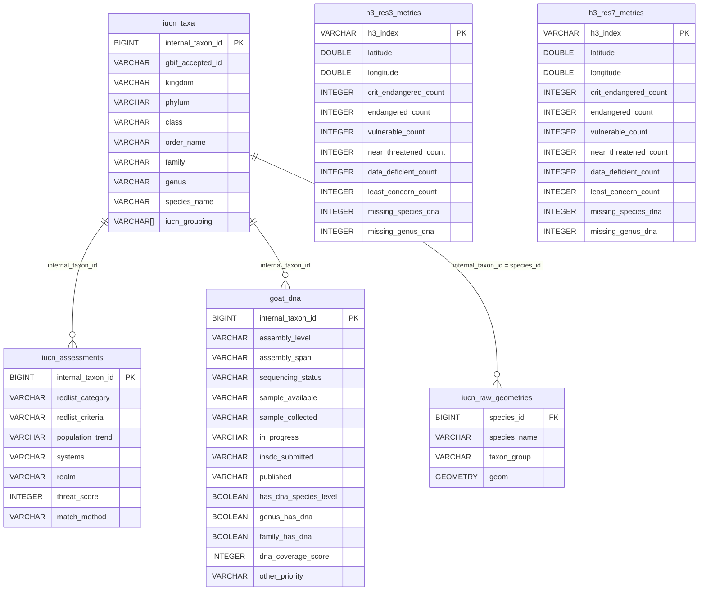

# Denmark Prototype: Implementation Plan

Aligns the Denmark prototype with the analytical architecture spec (3NF core database,
pre-aggregated H3 metrics tables, LOD rendering, on-the-fly scoring, buffered viewport queries).

No nightly processing — the pipeline runs on demand when source data changes.

---

## Current State vs. Target State

### Data Layer

| Aspect | Current | Target |
|--------|---------|--------|
| Storage | Loose Parquet files (`denmark.parquet`, `merged_gbif_denmark.parquet`, `h3_res3_denmark.parquet`, `h3_res7_denmark.parquet`) | Single `denmark.duckdb` with 3NF core tables + derived H3 metrics |
| Tabular data | Flat parquet with all columns denormalized | 3NF core tables (`iucn_taxa`, `goat_dna`, `iucn_assessments`) + `merged_species` view |
| H3 metrics | `h3_cell, n_species, total_priority, total_threat, n_no_dna` — precomputed priority | Separate CR/EN/VU counts + species/genus DNA gap columns — no precomputed priority |
| Raw geometries | `geom_wkb` column inside flat parquet | `iucn_raw_geometries` table (species_id, species_name, geom) |
| Scoring | `sampling_priority` precomputed and stored | Computed on-the-fly from metric columns × UI weights |
| Source of truth | Multiple files, risk of divergence | DuckDB is the single source of truth |

### IUCN Threat Levels in the Data

The IUCN Red List has 9 official categories. The Denmark sample covers 5 of these with threatened or near-threatened species:

| Category | Denmark | Included in H3 metrics? |
|---|---:|---|
| Critically Endangered | 6 | Yes — `crit_endangered_count` |
| Endangered | 12 | Yes — `endangered_count` |
| Vulnerable | 33 | Yes — `vulnerable_count` |
| Near Threatened | 39 | Yes — `near_threatened_count` |
| Data Deficient | 18 | Yes — `data_deficient_count` |
| Least Concern | 638 | Yes — `least_concern_count` |
| Extinct in the Wild | 0 | No — no living DNA to sequence |
| Extinct | 0 | No — no living DNA to sequence |
| Lower Risk\* | 0 | No — legacy categories |

The schema has columns for all 6 included categories in both the Denmark prototype and the global version, even if Denmark has zero rows for some. This ensures the same code and slider UI works everywhere.

### GOAT `other_priority` Field

The GOAT API returns an `other_priority` field (pipe-delimited EBP project codes like `DTOL`, `B10K`, `VGP`). Stored in the `goat_dna` table but **not included in the H3 metrics scoring formula** for now. It can be used as a filter/overlay in the future.

### H3 Metrics Schema Changes

Current `h3_res7_denmark.parquet`:

```
h3_cell        VARCHAR
n_species      BIGINT
total_priority BIGINT   ← precomputed, no weight control
total_threat   BIGINT   ← aggregated, no CR/EN/VU breakdown
n_no_dna       BIGINT   ← species-level only
```

Target `h3_res7_metrics`:

```
h3_index                  VARCHAR    PRIMARY KEY
latitude                  DOUBLE     (centroid, for bbox filter)
longitude                 DOUBLE     (centroid, for bbox filter)
crit_endangered_count     INTEGER
endangered_count          INTEGER
vulnerable_count          INTEGER
near_threatened_count     INTEGER
data_deficient_count      INTEGER
least_concern_count       INTEGER
missing_species_dna       INTEGER
missing_genus_dna         INTEGER
```

Key differences:
- **No `sampling_priority`** — computed client-side from weights × metric columns
- **CR, EN, VU, NT, DD, LC are separate** — enables independent weight sliders for each threat level
  - **Near Threatened (NT)** added — 39 species in Denmark (9,825 globally); these species are close to qualifying as threatened and are relevant for proactive conservation
  - **Data Deficient (DD)** added — 18 species in Denmark (22,760 globally); DD species may actually be threatened but lack assessment data, making them inherently uncertain and potentially high-priority
  - Extinct in the Wild (EW) and Extinct (EX) are excluded — no living DNA to sequence, so irrelevant for DNA gap analysis
- **`missing_genus_dna`** added — species where `genus_has_dna = false` (by definition, if the genus has zero DNA, every species within it also has zero DNA)
- **Latitude/longitude** added — enables bbox filtering without H3 library on the client
- **No `n_species`, `total_threat`, `n_no_dna`** — replaced by more granular columns

### Rendering Layer

| Aspect | Current (`denmark_maps.py`) | Target |
|--------|-----|--------|
| Zoom 0–3.99 | Not implemented | `H3HexagonLayer` from `h3_res3_metrics` — static load (same code path as global version) |
| Zoom 4–9.99 | Dropdown switch between res3/res7/raw | `H3HexagonLayer` from `h3_res7_metrics` — dynamic viewport query with 50% bbox padding, 250ms debounce |
| Zoom 10+ | Raw polygons via `PolygonLayer` + geoarrow | `MVTLayer` via `ST_AsMVTGeom` tile slicing (same code path as global version) |
| Coloring | Fixed `apply_continuous_cmap` on precomputed priority | On-the-fly: `score = CR×w1 + EN×w2 + VU×w3 + NT×w4 + DD×w5 + missing_sp_dna×w6 + missing_gen_dna×w7`, weights from UI sliders |
| Smoothing | Chaikin smoothing (Python-side, slow) | Removed — MVT tiles handle resolution at zoom 10+ |

---

## Implementation Progress

### Step 1: Create `denmark.duckdb` with 3NF core tables — **DONE**

- **File created**: `scripts/build_denmark_db.py`
- Tables created: `iucn_taxa` (746 rows), `iucn_assessments` (746 rows), `goat_dna` (746 rows), `merged_species` view
- `other_priority` column set to NULL (not present in source tabular parquet — can be populated later from GOAT API)
- Taxa deduplicated from spatial parquet using `DISTINCT ON (id_no)` since spatial has multiple range polygons per species

### Step 2: Create `iucn_raw_geometries` table — **DONE**

- 1,124 range polygons loaded from `denmark.parquet`
- `ST_GeomFromWKB(geom_wkb)` used to convert WKB to DuckDB GEOMETRY type

### Step 3: Create H3 metrics tables — **DONE**

- `h3_res3_metrics`: 15 cells at res 3 (Denmark is small)
- `h3_res7_metrics`: 35,873 cells at res 7
- Both use new granular schema (CR/EN/VU/NT/DD/LC counts + missing_species_dna + missing_genus_dna + lat/lng)
- Polyfill reuses `polyfill_geom()` pattern from `precompute_h3.py`
- All species included (not just threatened), per spec

### Step 4: Verify against old flat Parquet files — **DONE**

- All 35,873 H3 cells match between old `h3_res7_denmark.parquet` and new `h3_res7_metrics` table
- Threat scores (CR×3 + EN×2 + VU×1) match 100%: 35,873/35,873 cells
- `n_no_dna` vs `missing_species_dna` intentionally differs: old counted only threatened species with `dna_coverage_score == 0`; new counts ALL species with `has_dna_species_level == false`. New counts always >= old counts — correct per spec
- `denmark.duckdb` built and verified at `data/sample/denmark_prototype/denmark.duckdb`

### Step 5: Delete old flat H3 Parquet files — **PENDING**

- Verification passed; files can be deleted when ready:
  - `data/sample/spatial/h3_res3_denmark.parquet`
  - `data/sample/spatial/h3_res7_denmark.parquet`
  - `data/sample/spatial/h3_res3_hagfish.parquet`
  - `data/sample/spatial/h3_res7_hagfish.parquet`
- Hagfish H3 files are NOT yet covered by the DuckDB (only Denmark is); may want to add hagfish to the DB first or keep those files

### Step 6: Rewrite `denmark_maps.py` with LOD architecture — **DONE**

- Complete rewrite of `data/sample/denmark_prototype/denmark_maps.py`
- Connects to `denmark.duckdb` (read-only) instead of loading flat parquets
- 8 weight sliders: CR/EN/VU/NT/DD/LC/missing_sp_dna/missing_gen_dna
- LOD controlled by zoom/lon/lat sliders (marimo UI):
  - Zoom 0–4: H3HexagonLayer from `h3_res3_metrics` (static load, 15 cells)
  - Zoom 4–10: H3HexagonLayer from `h3_res7_metrics` (viewport query with 2° padded bbox)
  - Zoom 10+: PolygonLayer from `iucn_raw_geometries` (viewport query with 1° padded bbox, `ST_Intersects` + `ST_AsWKB`)
- On-the-fly scoring: `score = CR×w1 + EN×w2 + VU×w3 + NT×w4 + DD×w5 + LC×w6 + missing_sp×w7 + missing_gen×w8`
- Replaces dropdown-based view switch with automatic LOD
- Chaikin smoothing removed
- No MVT tile server (too complex for prototype) — PolygonLayer with viewport query at zoom 10+ instead
- Fallback to res3 if viewport query returns 0 results
- Boundary layer not included (H3 hexagons already show Denmark shape)

### Step 7: Update `scripts/precompute_h3.py` — **DONE**

- Added `precompute_to_duckdb()` function with new granular schema
- Old `precompute_spatial()` and `precompute_dir()` kept for backward compatibility (used by global notebooks)
- New function reads `redlistCategory`, `has_dna_species_level`, `genus_has_dna` columns
- Computes lat/lng centroids via `h3.cell_to_latlng()`
- Includes all species (not just threatened)

### Step 8: Update `scripts/create_sample_data.py` — **DONE**

- Added Step 5: calls `scripts/build_denmark_db.py` via subprocess after H3 precomputation
- Steps are now [1/4] through [5/5]

---

## Implementation Steps

### Step 1: Create `denmark.duckdb` with 3NF core tables

**New file**: `scripts/build_denmark_db.py`

The 3NF core ingests from the existing flat parquets and normalizes into proper relational tables. This is the same schema the global version will use — Denmark is just a smaller dataset.

#### Table: `iucn_taxa`

```sql
CREATE TABLE iucn_taxa (
    internal_taxon_id  BIGINT   PRIMARY KEY,
    gbif_accepted_id    VARCHAR,
    kingdom            VARCHAR,
    phylum             VARCHAR,
    class              VARCHAR,
    order_name         VARCHAR,
    family             VARCHAR,
    genus              VARCHAR,
    species_name       VARCHAR,
    iucn_grouping       VARCHAR[]   -- hierarchical group labels
);
```

Source: `data/sample/spatial/denmark.parquet` (deduplicated on `id_no`) + `data/sample/tabular/merged_gbif_denmark.parquet`

#### Table: `iucn_assessments`

```sql
CREATE TABLE iucn_assessments (
    internal_taxon_id  BIGINT   PRIMARY KEY,
    redlist_category   VARCHAR,
    redlist_criteria   VARCHAR,
    population_trend   VARCHAR,
    systems            VARCHAR,
    realm              VARCHAR,
    threat_score       INTEGER,
    match_method       VARCHAR
);
```

Source: `data/sample/tabular/merged_gbif_denmark.parquet`

#### Table: `goat_dna`

```sql
CREATE TABLE goat_dna (
    internal_taxon_id      BIGINT,
    assembly_level         VARCHAR,
    assembly_span          VARCHAR,
    sequencing_status      VARCHAR,
    sample_available       VARCHAR,
    sample_collected       VARCHAR,
    in_progress            VARCHAR,
    insdc_submitted        VARCHAR,
    published              VARCHAR,
    has_dna_species_level  BOOLEAN,
    genus_has_dna          BOOLEAN,
    family_has_dna         BOOLEAN,
    dna_coverage_score     INTEGER,
    other_priority         VARCHAR,
    PRIMARY KEY (internal_taxon_id)
);
```

Source: `data/sample/tabular/merged_gbif_denmark.parquet` (GOAT columns)

Note on `other_priority`: Pipe-delimited EBP project codes (e.g., `DTOL|PSYCHE`) indicating a species is a named priority for a genome sequencing project. Stored for potential future use as a filter/overlay; not included in the H3 scoring formula.

#### View: `merged_species`

Convenience view that re-joins the 3NF tables (mirrors the old flat `merged_gbif`):

```sql
CREATE VIEW merged_species AS
SELECT t.*, a.*, d.*
FROM iucn_taxa t
LEFT JOIN iucn_assessments a ON t.internal_taxon_id = a.internal_taxon_id
LEFT JOIN goat_dna d ON t.internal_taxon_id = d.internal_taxon_id;
```

### Step 2: Create `iucn_raw_geometries` table

Still in `scripts/build_denmark_db.py`:

```sql
CREATE TABLE iucn_raw_geometries (
    species_id    BIGINT,
    species_name  VARCHAR,
    taxon_group   VARCHAR,
    geom          GEOMETRY
);

-- Populate from flat parquet (one row per range polygon, not per species)
INSERT INTO iucn_raw_geometries
SELECT id_no, sci_name, taxon_group, ST_GeomFromWKB(geom_wkb)
FROM read_parquet('data/sample/spatial/denmark.parquet')
WHERE geom_wkb IS NOT NULL;
```

Note: A species can have multiple range polygons (Denmark has ~1,300 rows for ~800 species).
The `species_id` column links back to `iucn_taxa.internal_taxon_id`.

### Step 3: Create H3 metrics tables

Still in `scripts/build_denmark_db.py`. Polyfill each species range polygon, then aggregate per-H3-cell metrics.

#### Table: `h3_res3_metrics`

#### Table: `h3_res7_metrics`

Both share the same schema:

```sql
CREATE TABLE h3_resN_metrics (
    h3_index                VARCHAR    PRIMARY KEY,
    latitude                DOUBLE,
    longitude               DOUBLE,
    crit_endangered_count   INTEGER,
    endangered_count        INTEGER,
    vulnerable_count        INTEGER,
    near_threatened_count   INTEGER,
    data_deficient_count    INTEGER,
    least_concern_count     INTEGER,
    missing_species_dna     INTEGER,
    missing_genus_dna       INTEGER
);
```

Aggregation logic (same for both resolutions, different `res` parameter):

```python
for each species range polygon in iucn_raw_geometries:
    cells = polyfill_geom(geom, res)
    for cell in cells:
        if redlist_category == 'Critically Endangered': crit_endangered_count += 1
        if redlist_category == 'Endangered':            endangered_count += 1
        if redlist_category == 'Vulnerable':            vulnerable_count += 1
        if redlist_category == 'Near Threatened':       near_threatened_count += 1
        if redlist_category == 'Data Deficient':        data_deficient_count += 1
        if redlist_category == 'Least Concern':         least_concern_count += 1
        if dna_coverage_score == 0:                     missing_species_dna += 1
        if genus_has_dna == false:                      missing_genus_dna += 1

    latitude, longitude = h3.cell_to_latlng(h3_index)
```

Reuse `polyfill_geom()` from `scripts/precompute_h3.py`.

The same code works for both Denmark (small dataset) and the global version (7 GeoParquet files) — just change the input source.

### Step 4: Verify against old flat Parquet files

Before deleting the old H3 Parquet files, validate the new pipeline:

```python
# Load old flat parquet
old = con.sql("SELECT * FROM read_parquet('data/sample/spatial/h3_res7_denmark.parquet')").df()

# Load new DuckDB table
new = con.sql("SELECT * FROM h3_res7_metrics").df()

# Reconstruct old scores from new columns using default weights:
# sampling_priority = threat_score * (4 - dna_coverage_score)
# where threat_score = CR*3 + EN*2 + VU*1
# and dna_coverage_score mapped from missing_species_dna / missing_genus_dna
# Compare: do the H3 cells and their aggregated counts match?
```

If the counts match cell-for-cell, the new relational pipeline is verified. If they don't, debug the aggregation logic.

### Step 5: Delete old flat H3 Parquet files

After verification passes:

```
DELETE: data/sample/spatial/h3_res3_denmark.parquet
DELETE: data/sample/spatial/h3_res7_denmark.parquet
DELETE: data/sample/spatial/h3_res3_hagfish.parquet
DELETE: data/sample/spatial/h3_res7_hagfish.parquet
```

DuckDB is now the single source of truth. No risk of stale flat files diverging from the database.

Keep `data/sample/spatial/denmark.parquet` and `data/sample/spatial/hagfish.parquet` — these are the raw spatial source files used to build the DuckDB. They are the ingest input, not a duplicate cache.

### Step 6: Rewrite `denmark_maps.py` with LOD architecture

**File**: `data/sample/denmark_prototype/denmark_maps.py`

Replace the current 4-map layout with the spec's LOD system. Same code structure as the global version will use.

#### Cell 1: Connect to `denmark.duckdb`

```python
con = duckdb.connect("data/sample/denmark_prototype/denmark.duckdb")
con.execute("INSTALL spatial; LOAD spatial;")
```

#### Cell 2: Weight sliders

```python
weight_cr = mo.ui.slider(0, 10, value=3, step=0.5, label="Critical Weight")
weight_en = mo.ui.slider(0, 10, value=2, step=0.5, label="Endangered Weight")
weight_vu = mo.ui.slider(0, 10, value=1, step=0.5, label="Vulnerable Weight")
weight_nt = mo.ui.slider(0, 10, value=0.5, step=0.5, label="Near Threatened Weight")
weight_dd = mo.ui.slider(0, 10, value=0.5, step=0.5, label="Data Deficient Weight")
weight_lc = mo.ui.slider(0, 10, value=0.5, step=0.5, label="Least Concern Weight")
weight_sp_dna = mo.ui.slider(0, 10, value=3, step=0.5, label="Missing Species DNA Weight")
weight_gen_dna = mo.ui.slider(0, 10, value=1, step=0.5, label="Missing Genus DNA Weight")
mo.hstack([weight_cr, weight_en, weight_vu, weight_nt, weight_dd, weight_sp_dna, weight_gen_dna])
```

#### Cell 3: Zoom 0–4 — H3 res 3 (static load)

Load entire `h3_res3_metrics` table (small enough to fit in memory, same approach for global).

```python
h3_res3_df = con.sql("SELECT * FROM h3_res3_metrics").df()
# Client-side score per cell:
# score = crit_endangered_count * w_cr
#       + endangered_count * w_en
#       + vulnerable_count * w_vu
#       + near_threatened_count * w_nt
#       + data_deficient_count * w_dd
#       + least_concern_count * w_lc
#       + missing_species_dna * w_sp_dna
#       + missing_genus_dna * w_gen_dna
```

Even though Denmark at res 3 is only a handful of cells, the code path is identical to the
global version. This ensures the prototype validates the same architecture.

#### Cell 4: Zoom 4–10 — H3 res 7 (viewport query)

Dynamic query with 50% padded bbox, 250ms debounce:

```sql
SELECT h3_index, crit_endangered_count, endangered_count,
       vulnerable_count, near_threatened_count, data_deficient_count,
       least_concern_count, missing_species_dna, missing_genus_dna
FROM h3_res7_metrics
WHERE latitude BETWEEN :minLatPad AND :maxLatPad
  AND longitude BETWEEN :minLonPad AND :maxLonPad;
```

#### Cell 5: Zoom 10+ — MVT tile rendering

```sql
SELECT ST_AsMVTGeom(
         ST_Intersection(geom, ST_MakeEnvelope(:x1, :y1, :x2, :y2)),
         ST_MakeEnvelope(:x1, :y1, :x2, :y2)
       ) AS tile_geom,
       species_name
FROM iucn_raw_geometries
WHERE ST_Intersects(geom, ST_MakeEnvelope(:x1, :y1, :x2, :y2));
```

Implementation note: deck.gl's `MVTLayer` requires a tile server endpoint. For the Marimo prototype, implement a minimal in-notebook HTTP handler that:
1. Receives tile coordinate requests (z/x/y)
2. Converts to bounding box
3. Queries `iucn_raw_geometries` via `ST_AsMVT`
4. Returns MVT bytes

This is the same architecture the global version will use — just backed by a smaller database.

#### Cell 6: Viewport tracking + LOD switch

Use lonboard's map view state or marimo's reactive model to detect zoom level changes:

```python
if zoom < 4:
    # Render H3 res 3 layer (static)
elif zoom < 10:
    # Render H3 res 7 layer (viewport query)
else:
    # Render MVT polygon layer
```

This replaces the current dropdown-based view switch with automatic LOD.

### Step 7: Update `scripts/precompute_h3.py`

Refactor `precompute_spatial()` to produce the new schema:
- Break out CR/EN/VU counts separately (currently only `total_threat`)
- Add `missing_genus_dna` count (currently only `n_no_dna` for species-level)
- Compute lat/lng centroids via `h3.cell_to_latlng()` (currently not stored)
- Remove `total_priority` and `n_species` (replaced by granular columns)

Keep backward compatibility: `precompute_spatial()` still works for the old flat parquet
approach (used by `03_h3_gap_map.py` which reads from global GeoParquet files). Add a new
`precompute_to_duckdb()` function that writes to a DuckDB with the new schema.

### Step 8: Update `scripts/create_sample_data.py`

Add a final step that calls `scripts/build_denmark_db.py` to build `denmark.duckdb` from
the freshly generated flat parquets. The flat parquets remain as intermediate outputs of
the sample data generation pipeline — they are the ingest source for the DuckDB builder.

---

## File Changes Summary

| File | Action | Status |
|------|--------|--------|
| `scripts/build_denmark_db.py` | **NEW** — builds `denmark.duckdb` from flat parquets (3NF + H3 metrics) | **DONE** |
| `data/sample/denmark_prototype/denmark.duckdb` | **NEW** — analytical cache database (single source of truth) | **DONE** |
| `data/sample/denmark_prototype/denmark_maps.py` | **REWRITE** — LOD architecture with on-the-fly scoring | **DONE** |
| `scripts/precompute_h3.py` | **UPDATE** — add `precompute_to_duckdb()` with new schema | **DONE** |
| `scripts/create_sample_data.py` | **UPDATE** — add step to build denmark.duckdb | **DONE** |
| `data/sample/spatial/h3_res3_denmark.parquet` | **DELETE** after verification — superseded by DuckDB | **PENDING** |
| `data/sample/spatial/h3_res7_denmark.parquet` | **DELETE** after verification — superseded by DuckDB | **PENDING** |
| `data/sample/spatial/h3_res3_hagfish.parquet` | **DELETE** after verification — superseded by DuckDB | **PENDING** |
| `data/sample/spatial/h3_res7_hagfish.parquet` | **DELETE** after verification — superseded by DuckDB | **PENDING** |
| `data/sample/spatial/denmark.parquet` | **KEEP** — ingest source for DuckDB builder | — |
| `data/sample/spatial/hagfish.parquet` | **KEEP** — separate test dataset | — |
| `data/sample/tabular/merged_gbif_denmark.parquet` | **KEEP** — ingest source for DuckDB builder | — |

---

## 3NF Core Schema Diagram


